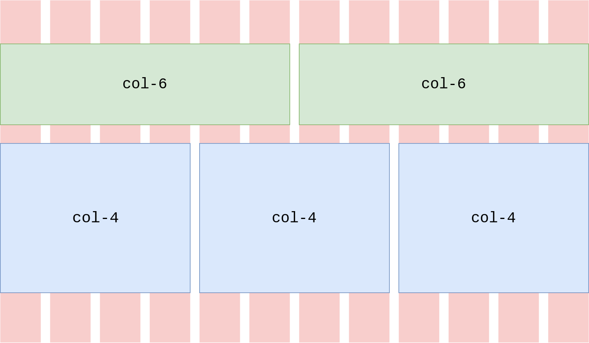

# Bootstrap


<!-- .element: class="r-stretch" -->

Sylvain Schellenberger

## Un Framework CSS


<!-- .element: class="r-stretch" -->

Créé par la société Twitter. Ex: [Centre d'assistance Twitter](https://help.twitter.com)

## Bénéfices

- Responsive Web Design
- Pas de CSS nécessaire
- Support et communauté

## Utiliser Bootstrap dans un projet

```html
<head>
	<!-- ... -->
	<link href="https://cdn.jsdelivr.net/npm/bootstrap@5.0.2/dist/css/bootstrap.min.css" rel="stylesheet" integrity="sha384-EVSTQN3/azprG1Anm3QDgpJLIm9Nao0Yz1ztcQTwFspd3yD65VohhpuuCOmLASjC" crossorigin="anonymous">
</head>
```

[Template de démarrage](https://help.twitter.com)

## Conteneurs <!-- .slide: class="split-panel-50-50" -->

```html
<header>
 <div class="container-fluid">
 </div>
</header>
<body>
 <div class="container">
 </div>
</body>
```


## Colonnes <!-- .slide: class="split-panel-50-50" -->

```html
<div class="container">
	<div class="row">
		<div class="col-6"></div>
		<div class="col-6"></div>
		<div class="col-4"></div>
		<div class="col-4"></div>
		<div class="col-4"></div>
	</div>
</div>
```



## Gouttières

```html
<div class="row gx-12 gy-18">
</div>
```


<!-- .element: class="r-stretch" -->

## Points de rupture <!-- .slide: class="split-panel" -->

| Breakpoint | Infix | Size |
| --- | --- | --- |
| Extra Small |  | <576px |
| Small | sm | >= 576px |
| Medium | md | >= 768px |
| Large | lg | >= 992px |
| Extra Large | xl | >= 1200px |
| Extra extra Large | xxl | >= 1400px | 


## Colonnes adaptables

```html
<div class="container">
	<div class="row">
		<div class="col-12 col-sm-6 col-lg-3"></div>
		<div class="col-12 col-sm-6 col-lg-3"></div>
		<div class="col-12 col-sm-6 col-lg-3"></div>
		<div class="col-12 col-sm-6 col-lg-3"></div>
	</div>
</div>
```


<!-- .element: class="fragment" -->

## Des composants

- Des barres de navigation: [https://getbootstrap.com/docs/5.0/components/navs-tabs/](https://getbootstrap.com/docs/5.0/components/navs-tabs/)
- Des cartes: [https://getbootstrap.com/docs/5.0/components/card/](https://getbootstrap.com/docs/5.0/components/card/)
- Des listes: [https://getbootstrap.com/docs/5.0/components/list-group/](https://getbootstrap.com/docs/5.0/components/list-group/)
-Des boutons: [https://getbootstrap.com/docs/5.0/components/buttons/](https://getbootstrap.com/docs/5.0/components/buttons/)

Et bien plus.

## Des utilitaires

- Pour les textes: [https://getbootstrap.com/docs/5.0/content/typography/](https://getbootstrap.com/docs/5.0/content/typography/)
- Pour les images: [https://getbootstrap.com/docs/5.0/content/images/](https://getbootstrap.com/docs/5.0/content/images/)
- Pour les fonds: [https://getbootstrap.com/docs/5.0/utilities/background/](https://getbootstrap.com/docs/5.0/utilities/background/)
- Pour les couleurs: [https://getbootstrap.com/docs/5.0/utilities/colors/](https://getbootstrap.com/docs/5.0/utilities/colors/)
- Pour les espacements: [https://getbootstrap.com/docs/5.0/utilities/spacing/](https://getbootstrap.com/docs/5.0/utilities/spacing/)

## Ressources

Documentation officielle Bootstrap: [https://getbootstrap.com/docs/5.0/getting-started/introduction/](https://getbootstrap.com/docs/5.0/getting-started/introduction/)