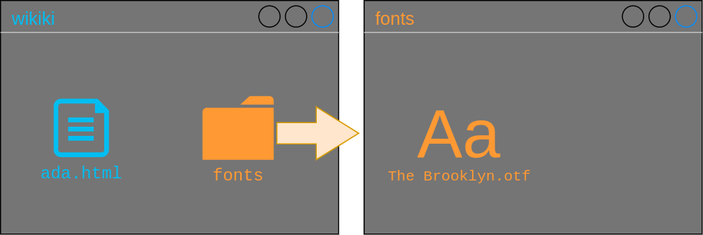

# CSS - Les bases

## Quésaco?


Cascading Style Sheet = Feuilles de Styles en Cascade

## L'attribut style

```html
<h1 style="color: blue;">Ada Lovelace</h1>
```

<iframe srcdoc="<h1 style='color: blue;'>Ada Lovelace</h1>"></iframe>

## La balise style

```html [2-6]
<head>
	<style>
		h1 {
			color: blue;
		}
	</style>
</head>
<body>
	<h1>Ada Lovelace</h1>
</body>
```

<iframe srcdoc="<head>
	<style>
		h1 {
			color: blue;
		}
	</style>
</head>
<body>
	<h1>Ada Lovelace</h1>
</body>">
</iframe>

## La feuille de style externe

```html [2]
<head>
	<link rel="stylesheet" href="style.css"/>
</head>
```


```css
h1 {
	color: blue;
}
```

## Anatomie d'une règle CSS


Notes: Cette règle s'applique à tous les éléments de type titre de niveau 1 ("h1").

## Les couleurs

Mot-clé:

```css
h1 {
	color: blue;
}
```

Liste des couleurs: [https://developer.mozilla.org/fr/docs/Web/CSS/color_value](https://developer.mozilla.org/fr/docs/Web/CSS/color_value)

### Valeurs RGB (Red, Green, Blue):

```css
p {
	color: rgb(128, 32, 32);
}
```


###

<iframe srcdoc="
<head><style>
h1 {
	color: blue;
}
p {
	color: rgb(128, 32, 32);
}
</style><h1>Ada Lovelace</h1>
	<p>Première programmeuse de l'histoire</p>"></iframe>

### Code hexadecimal:

```css
body {
	background-color: #d1b79c;
}
```


```css
body {
	background-color: rgb(209, 183, 156);
}
```

###

<iframe srcdoc="
<head>
<style>
	body {
		background-color: #d1b79c;
	}
	h1 {
		color: blue;
	}
	p {
		color: rgb(128, 32, 32);
	}
</style>
</head>
	<body>
		<h1>Ada Lovelace</h1>
		<p>Première programmeuse de l'histoire</p>
	</body>">
</iframe>
	
### Sélecteurs de couleur


[https://colorpicker.me/](https://colorpicker.me/)

## Les polices

```css
body {
	font-family: sans-serif;
}
```


### Familles

- **serif** (à empattement)
- **sans-serif** (sans empattement)
- **monospace** (espacement régulier)
- **cursive** (imitation écriture manuelle)
- **fantasy** (écriture décorative)
 
### Polices "Web safe"

~ Disponibles sur tous les navigateurs. Exemples:

- Arial (sans-serif)
- Times New Roman (serif)
- Courier New (monospace)
- Brush Script MT (cursive)

Liste: [https://www.w3schools.com/cssref/css_websafe_fonts.asp](https://www.w3schools.com/cssref/css_websafe_fonts.asp)

### Ajouter des polices

```css
@font-face {
	font-family: "The Brooklyn";
	src: url("fonts/The Brooklyn.otf") format("otf");
}

h1 {
	font-family: "The Brooklyn";
}
```



## Google Fonts

[https://fonts.google.com/](https://fonts.google.com/)

### Valeurs de remplacement

```css
h1 {
	font-family: "The Brooklyn", Arial, sans-serif;
}
```

*The Brooklyn* si disponible, sinon *Arial* si disponible, sinon la police sans-serif par défaut.

## Les dimensions

```css
p { 
	font-size: 16px; 
}
```

### Les unités relatives

```css
body {
	font-size: 16px;
}

h1 {
	font-size: 4em;
}
```

4 * 16 pixels = 64 pixels

### Hauteur de lignes

```css
h1 {
	font-size: 4em;
	line-height: 1.5;
}
```

1.5 * 4 * 16 pixels = 96 pixels

### Pourcentage

```css
h1 {
	font-size: 4em;
	line-height: 150%;
}
```

150 / 100 * 4 * 16 pixels = 96 pixels

## Styler un élément particulier

```html [3]
<body>
	<h1>Ada Lovelace</h1>
	<p id="tagline">Première programmeuse de l'histoire</p>
	<h2>Biographie</h2>
	<p>Né en 1816, ...</p>
	<p>Elle rencontre le mathématicien anglais Charles Babbage le 5 Juin 1833 (à l'âge de 17 ans), qui deviendra son tuteur et ami.</p>
</body>
```

```css
#tagline {
	font-size: 1.5em;
}
```

###

<iframe style="width: 100%; min-height: 60vh;" srcdoc="
<head>
<style>
	body {
		background-color: #d1b79c;
	}
	h1 {
		color: blue;
	}
	p {
		color: rgb(128, 32, 32);
	}
	#tagline {
		font-size: 1.5em;
	}
</style>
</head>
	<body>
		<h1>Ada Lovelace</h1>
	<p id=tagline>Première programmeuse de l'histoire</p>
	<h2>Biographie</h2>
	<p>Né en 1816, ...</p>
	<p>Elle rencontre le mathématicien anglais Charles Babbage le 5 Juin 1833 (à l'âge de 17 ans), qui deviendra son tuteur et ami.</p>
	</body>">
</iframe>

### Plusieurs éléments similaires

```html [5-6]
<body>
	<h1>Ada Lovelace</h1>
	<p id="tagline">Première programmeuse de l'histoire</p>
	<h2>Biographie</h2>
	<p class="info-text">Né en 1816, ...</p>
	<p class="info-text">Elle rencontre le mathématicien anglais Charles Babbage le 5 Juin 1833 (à l'âge de 17 ans), qui deviendra son tuteur et ami.</p>
</body>
```

```css
.info-text {
	font-family: Roboto, sans-serif;
}
```

###

<iframe style="width: 100%; min-height: 60vh;" srcdoc="
<head>
<style>
	body {
		background-color: #d1b79c;
	}
	h1 {
		color: blue;
	}
	p {
		color: rgb(128, 32, 32);
	}
	#tagline {
		font-size: 1.5em;
	}
	.info-text {
		font-family: Roboto, sans-serif;
	}
</style>
</head>
	<body>
	<h1>Ada Lovelace</h1>
	<p id=tagline>Première programmeuse de l'histoire</p>
	<h2>Biographie</h2>
	<p class=info-text>Né en 1816, ...</p>
	<p class=info-text>Elle rencontre le mathématicien anglais Charles Babbage le 5 Juin 1833 (à l'âge de 17 ans), qui deviendra son tuteur et ami.</p>
	</body>">
</iframe>

## La graisse

```css
h1 {
	font-weight: normal;
}

#tagline {
	font-weight: bold;
}
```

Autres valeurs: [https://developer.mozilla.org/fr/docs/Web/CSS/font-weight](https://developer.mozilla.org/fr/docs/Web/CSS/font-weight)

###

<iframe style="width: 100%; min-height: 60vh;" srcdoc="
<head>
<style>
	body {
		background-color: #d1b79c;
	}
	h1 {
		color: blue;
		font-weight: normal;
	}
	p {
		color: rgb(128, 32, 32);
	}
	#tagline {
		font-size: 1.5em;
		font-weight: bold;
	}
	.info-text {
		font-family: Roboto, sans-serif;
	}
</style>
</head>
	<body>
	<h1>Ada Lovelace</h1>
	<p id=tagline>Première programmeuse de l'histoire</p>
	<h2>Biographie</h2>
	<p class=info-text>Né en 1816, ...</p>
	<p class=info-text>Elle rencontre le mathématicien anglais Charles Babbage le 5 Juin 1833 (à l'âge de 17 ans), qui deviendra son tuteur et ami.</p>
	</body>">
</iframe>

## Les fonds

```css
body {
	background-image: url(assets/images/parchemin.png);
	background-repeat: no-repeat;
	background-position: cover;
}
```

Plus de possibilités: [https://developer.mozilla.org/fr/docs/Web/CSS/background-image](https://developer.mozilla.org/fr/docs/Web/CSS/background-image)

###

<iframe style="width: 100%; min-height: 60vh;" srcdoc="
<head>
<style>
	body {
		background-color: #d1b79c;
		background-image: url(assets/images/parchemin.jpeg);
	}
	h1 {
		color: blue;
	}
	p {
		color: rgb(128, 32, 32);
	}
	#tagline {
		font-size: 1.5em;
	}
	.info-text {
		font-family: Roboto, sans-serif;
	}
</style>
</head>
	<body>
	<h1>Ada Lovelace</h1>
	<p id=tagline>Première programmeuse de l'histoire</p>
	<h2>Biographie</h2>
	<p class=info-text>Né en 1816, ...</p>
	<p class=info-text>Elle rencontre le mathématicien anglais Charles Babbage le 5 Juin 1833 (à l'âge de 17 ans), qui deviendra son tuteur et ami.</p>
	</body>">
</iframe>

## Validateur W3C

Copier/coller le code CSS dans le validateur:

[http://jigsaw.w3.org/css-validator/#validate_by_input](http://jigsaw.w3.org/css-validator/#validate_by_input)