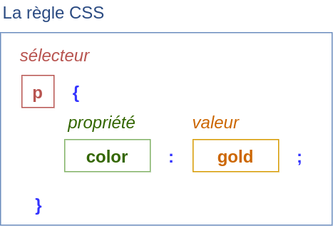
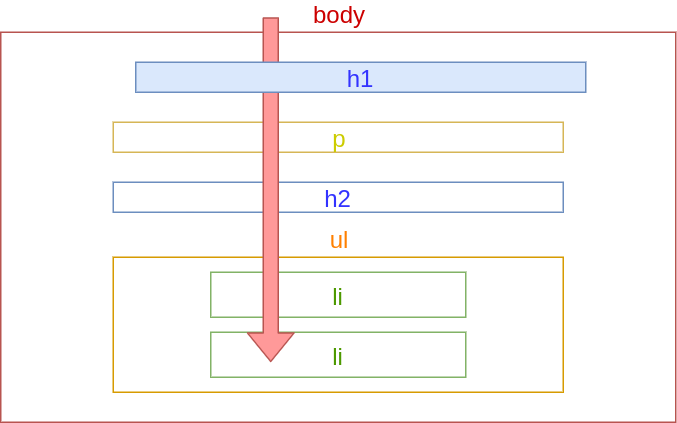

# CSS - Les bases

## Quésaco?


Cascading Style Sheet = Feuilles de Styles en Cascade

## L'attribut style

```html
<h1 style="color: gold;">Bob l'éponge</h1>
```

<iframe srcdoc="<h1 style='color: gold;'>Bob l'éponge</h1>"></iframe>

## La balise style

```html [2-6]
<head>
	<style>
		h1 {
			color: gold;
		}
	</style>
</head>
<body>
	<h1>Bob l'éponge</h1>
</body>
```

<iframe srcdoc="<head>
	<style>
		h1 {
			color: gold;
		}
	</style>
</head>
<body>
	<h1>Bob l'éponge</h1>
</body>">
</iframe>

## Anatomie d'une règle CSS



Notes: Cette règle s'applique à tous les éléments de type titre de niveau 1 ("h1").

## La feuille de style externe

```html [2]
<head>
	<link rel="stylesheet" href="style.css"/>
</head>
```


## Les couleurs

Mot-clé:

```css
h1 {
	color: gold;
}
```

Liste des couleurs: [https://developer.mozilla.org/en-US/docs/Web/CSS/color_value](https://developer.mozilla.org/en-US/docs/Web/CSS/color_value)

### Valeurs RGB (Red, Green, Blue):

```css
p {
	color: rgb(32, 32, 128);
}
```


### Code hexadecimal:

```css
body {
	background-color: #f2f2f2;
}
```


0, 1, 2, 3, ..., 9, *a, b, c, d, e, f,* 10, 11, 12, ..., *1a, 1b,* ...

## 

<iframe style="overflow: visible; width: 100%; height: 60vh;" 
		srcdoc="
				<head>
					<style>
						body {
								background-color: #c4c4c4;
							}
							h1 {
								color: gold;
							}
							p {
								color: rgb(32, 32, 128);
							}
					</style>
				</head>
				<body>
					
					<h1>Bob l'éponge</h1>
					<p>Cuisinier souriant</p>
					<h2>Sa vie</h2>
					<ul>
						<li>Habite à <strong>Bikini Bottom</strong></li>
						<li>Travaille au <strong>Crabe Croustillant</strong></li>
					</ul>
					<h2>Son oeuvre</h2>
					<ol>
						<li><a href=https://fr.wikipedia.org/wiki/Bob_l%27%C3%A9ponge,_le_film target=_blank>Bob l'éponge, le film</a></li>
						<li><a href=https://fr.wikipedia.org/wiki/Bob_l%27%C3%A9ponge,_le_film_:_Un_h%C3%A9ros_sort_de_l%27eau  target=_blank>Un héros sort de l'eau</a></li>
						<li><a href=https://fr.wikipedia.org/wiki/Bob_l%27%C3%A9ponge,_le_film_:_%C3%89ponge_en_eaux_troubles  target=_blank>Eponge en eaux troubles</a></li>
					</ol>
				</body>
			">
	</iframe>
	
### Sélecteurs de couleur


[https://colorpicker.me/](https://colorpicker.me/)

## La cascade

```css
body {
	color: rgb(32, 32, 128);
}
```


##

<iframe style="overflow: visible; width: 100%; height: 60vh;" 
		srcdoc="
				<head>
					<style>
						body {
							background-color: #c4c4c4;
							color: rgb(32, 32, 128);
						}
					</style>
				</head>
				<body>
					
					<h1>Bob l'éponge</h1>
					<p>Cuisinier souriant</p>
					<h2>Sa vie</h2>
					<ul>
						<li>Habite à <strong>Bikini Bottom</strong></li>
						<li>Travaille au <strong>Crabe Croustillant</strong></li>
					</ul>
					<h2>Son oeuvre</h2>
					<ol>
						<li><a href=https://fr.wikipedia.org/wiki/Bob_l%27%C3%A9ponge,_le_film target=_blank>Bob l'éponge, le film</a></li>
						<li><a href=https://fr.wikipedia.org/wiki/Bob_l%27%C3%A9ponge,_le_film_:_Un_h%C3%A9ros_sort_de_l%27eau  target=_blank>Un héros sort de l'eau</a></li>
						<li><a href=https://fr.wikipedia.org/wiki/Bob_l%27%C3%A9ponge,_le_film_:_%C3%89ponge_en_eaux_troubles  target=_blank>Eponge en eaux troubles</a></li>
					</ol>
				</body>
			">
	</iframe>
	
## La surcharge

```css [5-7]
body {
	background-color: #c4c4c4;
	color: rgb(32, 32, 128);
}
h1 {
	color: gold;
}
```



##

<iframe style="overflow: visible; width: 100%; height: 60vh;" 
		srcdoc="
				<head>
					<style>
						body {
							background-color: #c4c4c4;
							color: rgb(32, 32, 128);
						}
						h1 {
							color: gold;
						}
					</style>
				</head>
				<body>
					
					<h1>Bob l'éponge</h1>
					<p>Cuisinier souriant</p>
					<h2>Sa vie</h2>
					<ul>
						<li>Habite à <strong>Bikini Bottom</strong></li>
						<li>Travaille au <strong>Crabe Croustillant</strong></li>
					</ul>
					<h2>Son oeuvre</h2>
					<ol>
						<li><a href=https://fr.wikipedia.org/wiki/Bob_l%27%C3%A9ponge,_le_film target=_blank>Bob l'éponge, le film</a></li>
						<li><a href=https://fr.wikipedia.org/wiki/Bob_l%27%C3%A9ponge,_le_film_:_Un_h%C3%A9ros_sort_de_l%27eau  target=_blank>Un héros sort de l'eau</a></li>
						<li><a href=https://fr.wikipedia.org/wiki/Bob_l%27%C3%A9ponge,_le_film_:_%C3%89ponge_en_eaux_troubles  target=_blank>Eponge en eaux troubles</a></li>
					</ol>
				</body>
			">
	</iframe>
	
## Les polices

```css
body {
	font-family: sans-serif;
}
```


### Familles

- **serif** (à empattement)
- **sans-serif** (sans empattement)
- **monospace** (espacement régulier)
- **cursive** (imitation écriture manuelle)
- **fantasy** (écriture décorative)
 
### Polices "Web safe"

~ Disponibles sur les navigateurs. Exemples:

- Arial (sans-serif)
- Times New Roman (serif)
- Courier New (monospace)
- Brush Script MT (cursive)

Liste: [https://www.w3schools.com/cssref/css_websafe_fonts.asp](https://www.w3schools.com/cssref/css_websafe_fonts.asp)

### Ajouter des polices

```css
@font-face {
	font-family: "The Brooklyn";
	src: url("fonts/The Brooklyn.otf") format("otf");
}

h1 {
	font-family: "The Brooklyn";
}
```

### Valeurs de remplacement

```css
h1 {
	font-family: "The Brooklyn", Arial, sans-serif;
}
```

*The Brooklyn* si disponible, sinon *Arial* si disponible, sinon la police sans-serif par défaut.

## Les dimensions

## Les fonds

## Validateur W3C

---

# CSS - La mise en page

## Sélecteur de classes

```html
<div class="container">
	<!-- ... -->
</div>
```

```css
.container {
	
}
```

## Centrage

## Espacement

## Modèle de boîte

## TP: Mettre en page la présentation
