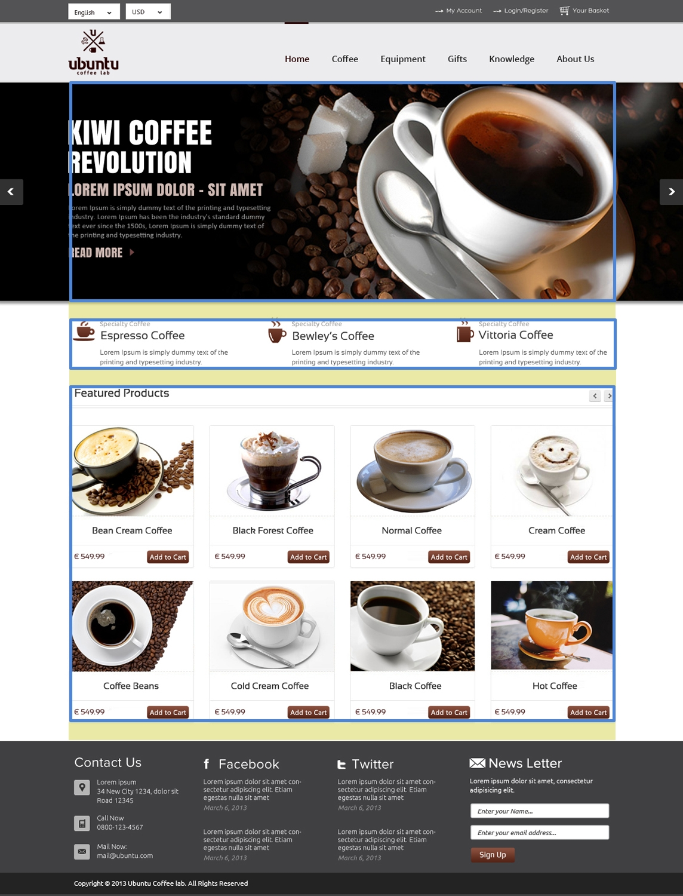
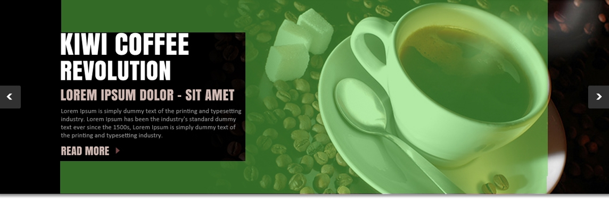
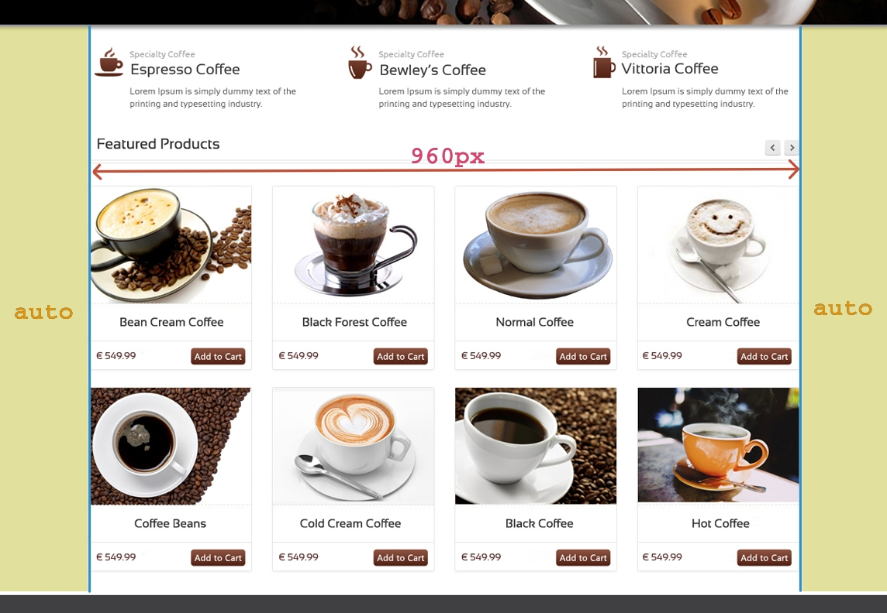

# CSS - Le modèle de boîte

Sylvain Schellenberger

## Composition de la boîte

```css
p {
	margin: 2em;
	border: 2px solid blue;
	padding: 8px;
}
```


## Marges <!-- .slide: class="split-panel-50-50" -->

```css
section {
	margin-top: 0;
	margin-right: 0;
	margin-left: 0;
	margin-bottom: 2em;
}
```



## Padding 

(~rembourrage, zone de remplissage)

```css
#accueil {
	padding-top: 4em;
	padding-right: 60%;
	padding-bottom: 4em;
	padding: 4em 60% 4em 0;
}
```



## Bordures <!-- .slide: class="split-panel-50-50" -->

```css
article {
	border-style: solid;
	border-width: 1px;
	border-color: grey;
}

h2 {
	border-bottom: 3px double grey;
}
```

<div>
<iframe style="background-color: white; width: 100%; min-height: 450px;" srcdoc="
<head>
	<style>
		article {
			border-style: solid;
			border-width: 1px;
			border-color: grey;
			padding: 1em;
		}
		h2 {
			border-bottom: 3px double grey;
		}
		img {
			width: 100%;
		}
	</style>
</head>
<body>
	<h2>Nos Produits</h2>
	<article>
		
		<h3>Pur Arabica</h3>
	</article>
</body>"></iframe>
</div>

## Dimensions d'un élément <!-- .slide: class="split-panel-50-50" -->

```css
img {
	width: 100%;
}
```


## Dimensions standards

```css
p {
	box-sizing: content-box;
	width: 350px;
	height: 150px;
}
```


## Dimensions à la bordure

```css
p {
	box-sizing: border-box;
	width: 350px;
	height: 150px;
}
```


## Dimensions maximales <!-- .slide: class="split-panel-50-50" -->

```css
main {
	min-width: 800px;
	max-width: 960px;
	margin-left: auto;
	margin-right: auto;
}
```



## Conteneurs centrés

```html
<section id="accueil">
	<div class="container">
		<h1>Kiwi Coffee Revolution</h1>
		<p>Lorem ipsum dolor sit amet</p>
	</div>
</section>
```

```css
#accueil {
	background-image: url('images/coffee-cup.jpeg');
}

.container {
	max-width: 960px;
	margin: auto;
}
```

##


<!-- .element: class="r-stretch" -->

## Inspecter la boîte


- `Ctrl + Maj + I`
- `F12`
- Clic droit > Inspecter

## Affichage "en bloc" <!-- .slide: class="split-panel-50-50" -->

```css
img {
	display: block;
}
```

<iframe style="background-color: white; min-height: 320px;" srcdoc="<head>
	<style>
		img {
			width: 150px;
			display: block;
		}
	</style>
</head>
<body>
	
	
</body>
"></iframe>

## Affichage "en ligne" <!-- .slide: class="split-panel-50-50" -->

```css
li {
	display: inline;
}
```

<iframe style="background-color: white;" srcdoc="<head>
	<style>
		li {
			display: inline;
		}
	</style>
</head>
<body>
	<ul>
		<li>Acceuil</li>
		<li>Services</li>
		<li>Produits</li>
		<li>A propos</li>
	</ul>
</body>
"></iframe>

## Affichage "bloc en ligne"

```css
article {
	display: inline-block;
	width: 33%;
	margin: 0 -1px;
}
```

<iframe style="background-color: white; width: 100%; min-height: 300px;" srcdoc="<head>
	<style>
		img {
			display: block;
			width: 100%;
		}
		article {
			display: inline-block;
			width: 33%;
			margin: 0 -1px;
		}
	</style>
</head>
<body>
	 <article>
        <h2>Pur Arabica</h2>
        
    </article>
    <article>
        <h2>Robusta</h2>
        
    </article>
    <article>
        <h2>Mocca</h2>
        
    </article>
</body>
"></iframe>

## Ressources

- Le modèle de Boîte, Mozilla Developers Network: [https://developer.mozilla.org/fr/docs/Learn/CSS/Building_blocks/The_box_model](https://developer.mozilla.org/fr/docs/Learn/CSS/Building_blocks/The_box_model)
- Inspirations pour portfolios: [https://dribbble.com/raaaahman/collections/5224514-portfolios](https://dribbble.com/raaaahman/collections/5224514-portfolios)

---

# Styles de boîtes

Sylvain Schellenberger

## Arrondis

```css
p {
	background-color: lightblue;
	border-radius: 12px;
}
```

<iframe style="background-color: white;" srcdoc="<head>
	<style>
		p {
			border: 2px dashed blue;
			background-color: lightblue;
		border-radius: 12px;
		}
	</style>
</head>
<body>
	<p>Le CSS, ça déboîte!</p>
</body>
"></iframe>

## Cercle parfait

```css
img {
	width: 150px;
	height: 150px;
	border-radius: 50%;
}
```

<iframe style="background-color: white; min-height: 175px;" srcdoc="<head>
	<style>
		img {
			width: 150px;
			height: 150px;
			border-radius: 50%;
		}
	</style>
</head>
<body>
	
</body>
"></iframe>


## Ombres

```css
img {
	box-shadow: 0 0 12px black; 
 } 
```

<iframe style="background-color: white; min-height: 175px;" srcdoc="<head>
	<style>
		img {
			width: 150px;
			height: 150px;
			border-radius: 50%;
			box-shadow: 0 0 12px black; 
		}
	</style>
</head>
<body>
	
</body>
"></iframe>

## Ressources

- Arrières plans et bordures; Mozilla Developers Network, [https://developer.mozilla.org/fr/docs/Learn/CSS/Building_blocks/Backgrounds_and_borders](https://developer.mozilla.org/fr/docs/Learn/CSS/Building_blocks/Backgrounds_and_borders)