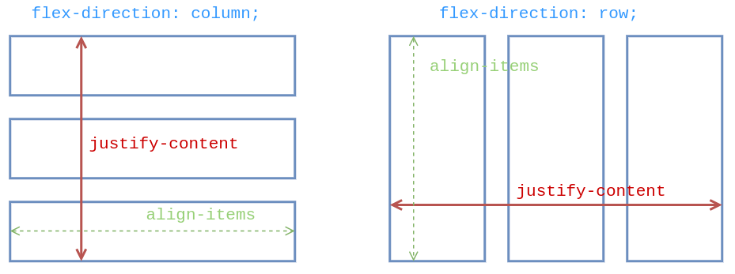

# CSS - Flexbox

Sylvain Schellenberger

## Disposition <!-- .slide: class="split-panel-50-50" -->

<div>

```html
<div class="container">
	<article>Projet 1</article>
	<article>Projet 2</article>
	<article>Projet 3</article>
</div>
```

```css
.container {
	display: flex;
}
```

</div>

<iframe src="assets/examples/css-flexbox/disposition.html"></iframe>

## Redimensionnement des objets <!-- .slide: class="split-panel-50-50" -->

```css
article {
	flex-grow: 1;
	flex-shrink: 0;
	flex-basis: 50%;
}
```

<iframe src="assets/examples/css-flexbox/redimensionnement.html"></iframe>

## Retour à ligne <!-- .slide: class="split-panel-50-50" -->

```css
.container {
	display: flex;
	flex-wrap: wrap;
}
```

<iframe src="assets/examples/css-flexbox/wrap.html"></iframe>

## Direction <!-- .slide: class="split-panel-50-50" -->

```css
.container {
	display: flex;
	flex-direction: column;
}
```

<iframe src="assets/examples/css-flexbox/direction.html"></iframe>

## Alignement (axe principal) <!-- .slide: class="split-panel-50-50" -->

```css
.container {
    height: 200px;
    display: flex;
	flex-direction: column;
    justify-content: space-between;
}
```

<iframe src="assets/examples/css-flexbox/align-main-axis.html"></iframe>

## Alignement (axe croisé) <!-- .slide: class="split-panel-50-50" -->

```css
.container {
    height: 200px;
    display: flex;
	flex-direction: column;
    justify-content: space-between;
    align-items: center;
}
```

<iframe src="assets/examples/css-flexbox/align-cross-axis.html"></iframe>

## Directions et alignement



## Mise en pratique <!-- .slide: class="split-panel-50-50" -->

```css
.container {
    display: flex;
    flex-wrap: wrap;
    justify-content: space-between;
    align-items: stretch;
}

.container > article {
    box-sizing: border-box;
    flex-basis: 30%;
    background-color: lightblue;
    padding: 1em;
}

img {
    width: 100%;
}
```


<iframe src="assets/examples/css-flexbox/practice.html"></iframe>

## Ressources

- Flexbox, Mozilla Developers Network, [https://developer.mozilla.org/fr/docs/Learn/CSS/CSS_layout/Flexbox](https://developer.mozilla.org/fr/docs/Learn/CSS/CSS_layout/Flexbox)
- A complete Guide to Flexbox, CSS Tricks, [https://css-tricks.com/snippets/css/a-guide-to-flexbox/](https://css-tricks.com/snippets/css/a-guide-to-flexbox/)
- Flexbox Froggy, [https://flexboxfroggy.com/#fr](https://flexboxfroggy.com/#fr)
- Solved by flexbox, Philip Walton, [https://philipwalton.github.io/solved-by-flexbox/](https://philipwalton.github.io/solved-by-flexbox/)