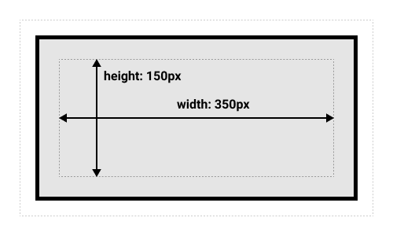

# Sélecteurs CSS

## Descendance des éléments HTML

```html
<html>
	<body>
		<h1>Neskawa</h1>
		<p>Du bon kawa</p>
		<p>Issu du commerce (presque) équitable et de l'agriculture (un peu) biologique!</p>
	</body>
</html>
``` 
<!-- .element: style="display: inline-block; width: 45%;" -->

 
<!-- .element: style="display: inline-block; width: 45%;" -->

## Enfants directs

```css
html > body
```


## Descendant

```css
html p
```


## Frères et soeurs (adjacence)

```css
h1 + p
```


## Frères et soeurs (général)

```css
h1 ~ p
```


## Plusieurs éléments

```css
h1, p
```


## Pseudo-éléments

```css
p::last-child
```


##

```css
h1::last-of-type
```


## Pseudo-classes

```css
a:hover {
	text-decoration: underline dotted;
}
```

<iframe style="backrgound-color: white;" srcdoc="
<head>
	<style>
		a:hover {
			text-decoration: underline dotted;
		}
	</style>
</head>
<body>
	<a href=#>Achète moi!</a>
</body>"></iframe>

##

```css
a:visited {
	color: red;
}
```

<iframe style="background-color: white;" srcdoc="
<head>
	<style>
		a:visited {
			color: red;
		}
	</style>
</head>
<body>
	<a href=#>Achète moi!</a>
</body>"></iframe>

## Ressources

- Sélecteurs CSS, Mozilla Developers Network: [https://developer.mozilla.org/fr/docs/Learn/CSS/Building_blocks/Selectors](https://developer.mozilla.org/fr/docs/Learn/CSS/Building_blocks/Selectors)
- CSS Diner, Flukeout: [https://flukeout.github.io/](https://flukeout.github.io/)

---

# CSS - Le modèle de boîte

## Composition de la boîte

```css
p {
	margin: 12px;
	border: 1px solid black;
	padding: 6px;
}
```


## Dimensions standards

```css
p {
	box-sizing: content-box;
	width: 350px;
	height: 150px;
}
```



## Dimensions à la bordure

```css
p {
	box-sizing: border-box;
	width: 350px;
	height: 150px;
}
```


## Bordures

```css
p {
	border-style: dashed;
	border-width: 2px;
	border-color: blue;
	border: 2px dashed blue;
}
```

<iframe style="background-color: white;" srcdoc="<head>
	<style>
		p {
			border-style: dashed;
			border-width: 2px;
			border-color: blue;
			border: 2px dashed blue;
		}
	</style>
</head>
<body>
	<p>Le CSS, ça déboîte!</p>
</body>
"></iframe>

## Bordures directionnelles

```css
section {
	border-top: 2px solid black;
	border-right: none;
	border-left: none;
	border-bottom: 2px solid black;
}
```

<iframe style="background-color: white; min-width: 400px; min-height: 200px;" srcdoc="<head>
	<style>
		section {
			border-top: 2px solid black;
			border-right: none;
			border-left: none;
			border-bottom: 2px solid black;
		}
	</style>
</head>
<body>
	<section>
		<h2>Nos Produits</h2>
	</section>
	<section>
		<h2>Avis consommateurs</h2>
	</section>
</body>
"></iframe>

## Arrondis

```css
p {
	background-color: lightblue;
	border-radius: 12px;
}
```

<iframe style="background-color: white;" srcdoc="<head>
	<style>
		p {
			border: 2px dashed blue;
			background-color: lightblue;
		border-radius: 12px;
		}
	</style>
</head>
<body>
	<p>Le CSS, ça déboîte!</p>
</body>
"></iframe>

## Cercle parfait

```css
img {
	width: 150px;
	height: 150px;
	border-radius: 50%;
}
```

<iframe style="background-color: white; min-height: 175px;" srcdoc="<head>
	<style>
		img {
			width: 150px;
			height: 150px;
			border-radius: 50%;
		}
	</style>
</head>
<body>
	
</body>
"></iframe>


## Ombres

```css
img {
	box-shadow: 0 0 12px black; 
 } 
```

<iframe style="background-color: white; min-height: 175px;" srcdoc="<head>
	<style>
		img {
			width: 150px;
			height: 150px;
			border-radius: 50%;
			box-shadow: 0 0 12px black; 
		}
	</style>
</head>
<body>
	
</body>
"></iframe>

## Positionnement "en bloc"

```css
img {
	display: block;
}
```

<iframe style="background-color: white; min-height: 320px;" srcdoc="<head>
	<style>
		img {
			width: 150px;
			height: 150px;
			border-radius: 50%;
			box-shadow: 0 0 12px black;
			display: block;
		}
	</style>
</head>
<body>
	
	
</body>
"></iframe>

## Positionnement "en ligne"

```css
li {
	display: inline;
}
```

<iframe style="background-color: white;" srcdoc="<head>
	<style>
		li {
			display: inline;
		}
	</style>
</head>
<body>
	<ul>
		<li>Acceuil</li>
		<li>Produits</li>
		<li>Avis</li>
	</ul>
</body>
"></iframe>

## Positionnement "bloc en ligne"

```css
article {
	display: inline-block;
	width: 33%;
	margin: -1px;
}
```

<iframe style="background-color: white; width: 100%; min-height: 300px;" srcdoc="<head>
	<style>
		img {
			display: block;
			width: 100%;
		}
		article {
			display: inline-block;
			width: 33%;
			margin-right: -1px;
			margin-left: -1px;
		}
	</style>
</head>
<body>
	 <article>
        <h2>Pur Arabica</h2>
        
    </article>
    <article>
        <h2>Robusta</h2>
        
    </article>
    <article>
        <h2>Mocca</h2>
        
    </article>
</body>
"></iframe>

## Inspecter la boîte


- `Ctrl + Maj + I`
- `F12`
- Clic droit > Inspecter

## Ressources

Le modèle de Boîte, Mozilla Developers Network: [https://developer.mozilla.org/fr/docs/Learn/CSS/Building_blocks/The_box_model](https://developer.mozilla.org/fr/docs/Learn/CSS/Building_blocks/The_box_model)

---

# La cascade

```css
body {
	color: rgb(32, 32, 128);
}
```


##

<iframe style="overflow: visible; width: 100%; height: 60vh;" 
		srcdoc="
				<head>
					<style>
						body {
							background-color: #c4c4c4;
							color: rgb(32, 32, 128);
						}
					</style>
				</head>
				<body>
					
					<h1>Bob l'éponge</h1>
					<p>Cuisinier souriant</p>
					<h2>Sa vie</h2>
					<ul>
						<li>Habite à <strong>Bikini Bottom</strong></li>
						<li>Travaille au <strong>Crabe Croustillant</strong></li>
					</ul>
					<h2>Son oeuvre</h2>
					<ol>
						<li><a href=https://fr.wikipedia.org/wiki/Bob_l%27%C3%A9ponge,_le_film target=_blank>Bob l'éponge, le film</a></li>
						<li><a href=https://fr.wikipedia.org/wiki/Bob_l%27%C3%A9ponge,_le_film_:_Un_h%C3%A9ros_sort_de_l%27eau  target=_blank>Un héros sort de l'eau</a></li>
						<li><a href=https://fr.wikipedia.org/wiki/Bob_l%27%C3%A9ponge,_le_film_:_%C3%89ponge_en_eaux_troubles  target=_blank>Eponge en eaux troubles</a></li>
					</ol>
				</body>
			">
	</iframe>
	
## La surcharge

```css [5-7]
body {
	background-color: #c4c4c4;
	color: rgb(32, 32, 128);
}
h1 {
	color: gold;
}
```


##

<iframe style="overflow: visible; width: 100%; height: 60vh;" 
		srcdoc="
				<head>
					<style>
						body {
							background-color: #c4c4c4;
							color: rgb(32, 32, 128);
						}
						h1 {
							color: gold;
						}
					</style>
				</head>
				<body>
					
					<h1>Bob l'éponge</h1>
					<p>Cuisinier souriant</p>
					<h2>Sa vie</h2>
					<ul>
						<li>Habite à <strong>Bikini Bottom</strong></li>
						<li>Travaille au <strong>Crabe Croustillant</strong></li>
					</ul>
					<h2>Son oeuvre</h2>
					<ol>
						<li><a href=https://fr.wikipedia.org/wiki/Bob_l%27%C3%A9ponge,_le_film target=_blank>Bob l'éponge, le film</a></li>
						<li><a href=https://fr.wikipedia.org/wiki/Bob_l%27%C3%A9ponge,_le_film_:_Un_h%C3%A9ros_sort_de_l%27eau  target=_blank>Un héros sort de l'eau</a></li>
						<li><a href=https://fr.wikipedia.org/wiki/Bob_l%27%C3%A9ponge,_le_film_:_%C3%89ponge_en_eaux_troubles  target=_blank>Eponge en eaux troubles</a></li>
					</ol>
				</body>
			">
	</iframe>

## Spécificité

## Héritage

## Reset et Normalize