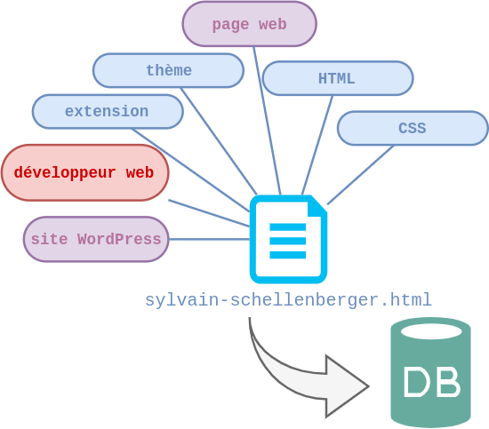
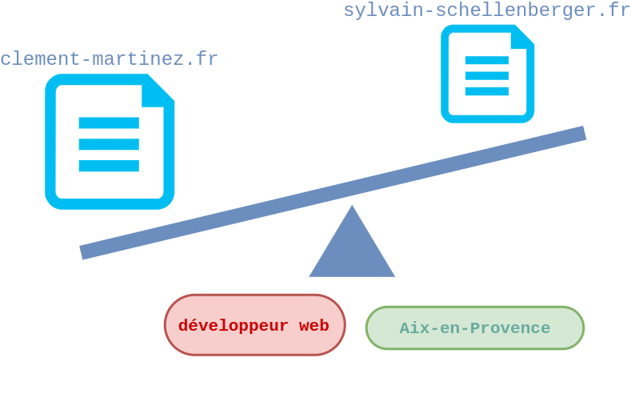
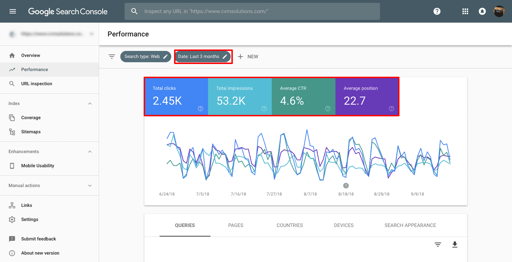
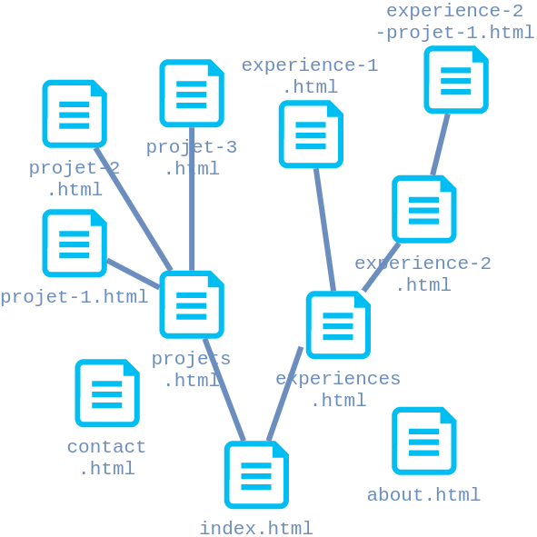
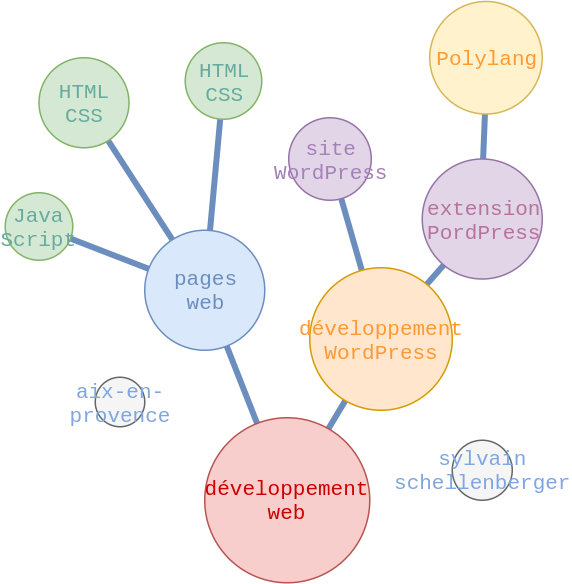

# Google et le référencement naturel

Sylvain Schellenberger

## Processus en trois étapes

<div class="row">

<div>


Exploration (crawling) 

</div>

<div class="fragment">


Indexation (indexing)
	
</div>

<div class="fragment">


Diffusion (discovery/ranking)

</div>

</div>

### Exploration

<div class="r-stack r-stretch">


 <!-- .element: class="fragment current-visible" data-fragment-index="0" -->

 <!-- .element: class="fragment current-visible" data-fragment-index="1" -->

 <!-- .element: class="fragment current-visible" data-fragment-index="2" -->

</div>

<div class="r-stack">
<div class="fragment current-visible" data-fragment-index="0"><pre><code class="hljs html"><a href="page-a.html">Page A</a></code></pre></div>
<div class="fragment current-visible" data-fragment-index="1"><pre><code class="hljs html"><a href="page-b.html">Page B</a></code></pre></div>
<div class="fragment current-visible" data-fragment-index="2"><pre><code class="hljs html"><a href="page-c.html">Page C</a></code></pre></div>
</div>

### Indexation <!-- .slide: class="split-panel-50-50" -->

```html
<h1>Développeur Web</h1>

<h2>Création de page web sur mesure</h2>
<p> ... <strong>HTML</strong> ... <strong>CSS</strong> ... </p>

<h2>Installation de site WordPress</h2>
<p> ...<strong>thème</strong> ... <strong>extension</strong> ... </p>
```



### Diffusion



## Google Search Console



[https://search.google.com/search-console](https://search.google.com/search-console)

### Enregistrer sa propriété

1. Se connecter à son compte Google
2. Créer une nouvelle propriété (préfixe de l'url)
3. Ouvrir un client FTP (FileZilla) et envoyer la page HTML sur le serveur

### Les métriques

- **Impresions**: apparitions du site dans les résultats de recherche
- **Clics**: visiteurs ayant cliqué sur le lien dans les résultats de recherche
- **Click Through Ratio**: ratio clics / impressions
- **Position Moyenne**: position dans les résultats de recherche / impressions

### Les dimensions: 

- **Requêtes**: Mots-clés ayant permis d'afficher vos résultats dans les moteurs de recherche
- **Pages**: Pages de votre site ayant été consultées
- **Pays**: Origine des visiteurs
- **Appareils**: Type d'appareil sur lequel le site est consulté (bureau/mobile, modèle)

### Couverture de l'index

- **Erreur**: Page non indexée
- **Avertissement**: Page indexée avec un problème
- **Valide**: Page indexée
- **Exclue**: Page techniquement valide, mais non indexée

## Les sitemaps <!-- .slide: class="split-panel-50-50" -->

```xml
<urlset xmlns="http://www.sitemaps.org/schemas/sitemap/0.9">

   <url>
      <loc>http://devindetails.fr/index.html</loc>
      <lastmod>2005-01-01</lastmod>
      <changefreq>monthly</changefreq>
      <priority>0.8</priority>
   </url>
   
   <!-- ... -->

</urlset> 
```



### Sitemaps VS Maillage interne <!-- .slide: class="split-panel-50-50" -->

<div class="row">
<div>

| URL | Last Mod. |
|--------|---------------|
| /index.html | 2021-12-08 |
| /about.html | 2021-12-08 |
| /contact.html | 2021-12-08 |
| /projets.html | 2021-12-08 |

<p class="fragment">Exploration</p>

</div>
<div>



<p class="fragment">Indexation</p>
</div>
</div>

### Avez-vous besoin d'un sitemap?

Oui si:

- Votre site contient beaucoup de pages (milliers) <!-- .element: class="fragment" -->
- Certaines de vos pages sont isolées (mauvaise idée) <!-- .element: class="fragment" -->
- Votre site est nouveau et a peu de "backlinks" <!-- .element: class="fragment" -->
- Votre site ajoute fréquemment du contenu (site de news) <!-- .element: class="fragment" -->

## Inspecteur d'URL

- Google peut-il indexer ma page?
- Tester en direct > re-vérifier une page après changements
- Re-indexer > re-demander l'indexation de la page après changements

### Erreur 404

 <!-- .element: class="r-stretch" -->

<div class="r-stack">
<div class="fragment current-visible">

- La page n'existe pas à l'URL indiquée
- L'URL désigne une page protégée par mot de passe

</div>
<div class="fragment current-visible">

- Refaire le sitemap en corrigeant ou excluant l'URL 
- Chercher le mauvais lien hypertexte dans le HTML

</div>
</div>

### Contenu dupliqué

Deux URL renvoie sur la même page, exemple:

`https://example.com` et `https://example.com/accueil`

<div class="fragment">

```html
<head>
	<link rel="canonical" href="https://example.com/" />
</head>
```

</div>

### Balise robots

```html
<meta name="robots" content="noindex, follow">
```

ou 

```html
<meta name="robots" content="noindex, nofollow">
```

### Fichier robots.txt

```txt
User-agent: Googlebot
Disallow: /author/

User-agent: *
Allow: /

Sitemap: http://www.example.com/sitemap_index.xml
```

## Pistes d'amélioration

### Faible CTR

Impressions >>> clicks

<div class="fragment">

```html
<head>
	<title>Je pèse sur mon mot-clé principal</title>
	<meta name="description" content="Ce site envoie du rêve sur votre requête, venez le lire, la 3 va vous étonner!">
</head>
```

</div>

### Mot-clés absents

Mots-clés faisant partie de votre stratégie n'apparaissant pas dans les résultats de recherche

<div class="fragment">

```html
<body>
	<h1>Mon mot-clé principal</h1>
	<p>Ce site parle de mon <strong>mot-clé principal</strong>, à travers <strong>mot-clé secondaire</strong> et <strong>autre mot-clé secondaire</strong></p>
	
	<h2>Mot-clé secondaire</h2>
	<!-- ... -->
</body>
```

</div>

### Pages absentes

Pages importantes de votre site peu consultées

<ol>
<li class="fragment"> A-t-elle un problème d'indexation?<span class="fragment"> > Inspecteur d'URL</span></li>
<li class="fragment">Son contenu est-il suffisamment pertinent?<span class="fragment"> > Optimisation des mot-clés </span></li>
<li class="fragment">Est-elle bien reliée à mes autres pages?<span class="fragment"> > Maillage interne</span></li>
</ol>

## Ressources

- Google Search Central, Guide de démarrage rapide: principes de base de la recherche Google, [developers.google.com/search/docs/basics/get-started](https://developers.google.com/search/docs/basics/get-started?hl=fr)
- A propos de la Search Console, Aide Search Console: [support.google.com/webmasters](https://support.google.com/webmasters/answer/9128668?hl=fr&ref_topic=9128571#zippy=)
- Les sitemaps XML natifs de WordPress: [seomix.fr/wordpress-xml-sitemaps](https://www.seomix.fr/wordpress-xml-sitemaps/)
