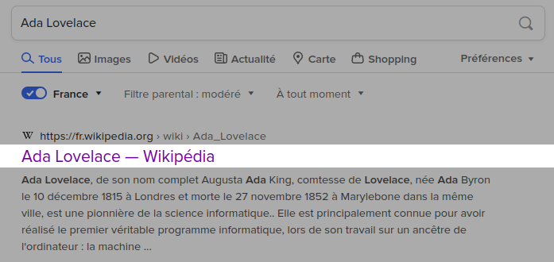
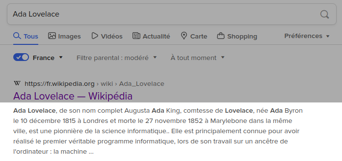
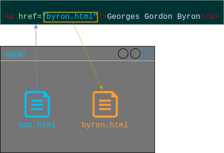
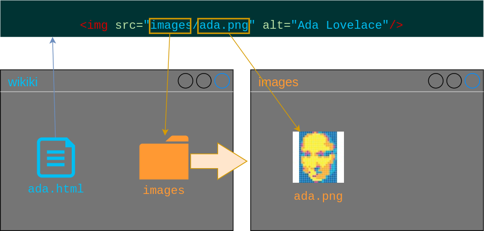
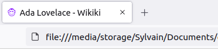

# HTML - Précisions

## Le titre (pour le navigateur)

```html [4]
<!DOCTYPE html>
<html lang="fr">
	<head>
		<title>Ada Lovelace - Wikiki</title>
	</head>
</html>
```



## Les balises meta

```html [6]
<!DOCTYPE html>
<html lang="fr">
	<head>
		<title>Ada Lovelace - Wikiki</title>
		<meta charset="utf-8"/>
		<meta name="description" content="Hommage à Ada Lovelace, première programmeuse de l'histoire."/>
	</head>
</html>
```



## Descendance

```html
<html lang="fr">
	<body>
		<h1>Ada Lovelace</h1>
		<p>Première programmeuse de l'histoire</p>
	</body>
</html>
```


## Les chemins relatifs (liens)



## Les chemins relatifs (images)



---

# Plus d'éléments

## Les commentaires

```html [2]
<body>
	<!-- Ce commentaire n'est pas affiché -->
	<p>Ce texte est affiché.</p>
</body>
```

<iframe style="background-color: white;" srcdoc="<!-- Ce commentaire n'est pas affiché -->
	<p>Ce texte est affiché.</p>"></iframe>

## Les conteneurs

```html [2,5]
<body>
	<div>
		<p>Premier paragraphe</p>
		<p>Second paragraphe</p>
	</div>
</body>
```

<iframe style="background-color: white;" srcdoc="<body>
	<div>
		<p>Premier paragraphe</p>
		<p>Second paragraphe</p>
	</div>
</body>">
</iframe>

## Les conteneurs (en ligne)

```html
<p>Première programmeuse de l'<span>Histoire</span></p>
```

<iframe style="background-color: white;" srcdoc="<body>
	<p>Première programmeuse de l'<span>Histoire</span></p>
</body>">
</iframe>

## Les figures

```html
<figure>
		
</figure>
```

<iframe style="background-color: white; width: 100%; min-height: 60vh;" srcdoc="<figure>
		
</figure>"></iframe>

## Les figures (avec légende)

```html [3]
<figure>
		
		<figcation>Ada Lovelace a créé le premier programme informatique, avant même que les ordinateurs n'existent!</figcation>
</figure>
```

<iframe style="background-color: white; width: 100%; min-height: 60vh;" srcdoc="<figure>
		
		<figcation>Ada Lovelace a créé le premier programme informatique, avant même que les ordinateurs n'existent!</figcation>
</figure>"></iframe>

## Les citations

```html
<blockquote>
		<p> Beaucoup de personnes […] </p>
</blockquote>
```

<iframe style="background-color: white;" srcdoc="<blockquote>
		<p> Beaucoup de personnes […]</p>
	</blockquote>"></iframe>

## Les citations (avec auteur·e)

```html [3]
<blockquote>
		<p> Beaucoup de personnes […]</p>
		<cite>Ada Lovelace</cite>
</blockquote>
```

<iframe style="background-color: white;" srcdoc="<blockquote>
		<p> Beaucoup de personnes […]</p>
		<cite>Ada Lovelace</cite>
	</blockquote>"></iframe>

## Le favicon

```html [3]
<head>
	<title>Wikiki</title>
	<link rel="icon" type="image/png" href="images/chimp.png"/>
</head>
```



---

# Bonus: Extension Emmet

[https://www.emmet.io/](https://www.emmet.io/)

### Installation (Sublime Text)

1. Ouvrir l'invite de commande: `Ctrl + Maj + P` (`Cmd + Maj + P`)
2. Ecrire: `Package Control: Install Package`
3. Dans la liste, chercher `Emmet` et valider

### Utilisation (Sublime Text)

1. Ecrire le raccourci `html:5`
2. Ouvrir l'invite de commande: `Ctrl + Maj + P` (`Cmd + Maj + P`)
3. Ecrire: `Emmet: Expand Abbreviation`