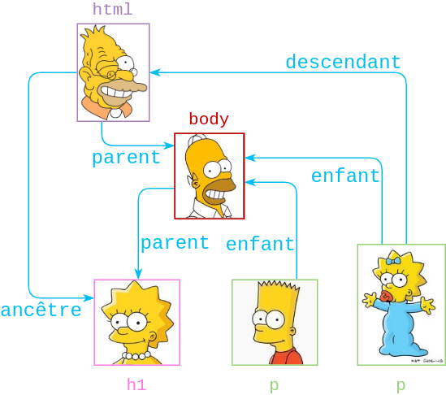

# HTML - Précisions

## Structure des fichiers


## Le titre (pour le navigateur)

```html [4]
<!DOCTYPE html>
<html lang="fr">
	<head>
		<title>Ada Lovelace - Wikiki</title>
	</head>
</html>
```


## Les balises meta

```html [6]
<!DOCTYPE html>
<html lang="fr">
	<head>
		<title>Ada Lovelace - Wikiki</title>
		<meta charset="utf-8"/>
		<meta name="description" content="Hommage à Ada Lovelace, première programmeuse de l'histoire."/>
	</head>
</html>
```


## Descendance

```html
<html lang="fr">
	<body>
		<h1>Ada Lovelace</h1>
		<p>Première programmeuse de l'histoire</p>
	</body>
</html>
```



## Les chemins relatifs (images)

```html

```


## Les chemins relatifs (liens)

```html
<a href="georges-gordon-byron.html">George Gordon Byron</a>
```


---

# Plus d'éléments

## Les commentaires

```html [3]
<body>
	<!-- Ce commentaire n'est pas affiché -->
	<p>Ce texte est affiché.</p>
</body>
```

<iframe style="background-color: white;" srcdoc="<!-- Ce commentaire n'est pas affiché -->
	<p>Ce texte est affiché.</p>"></iframe>

## Les conteneurs

```html [2,5]
<body>
	<div>
		<p>Premier paragraphe</p>
		<p>Second paragraphe</p>
	</div>
</body>
```

<iframe style="background-color: white;" srcdoc="<body>
	<div>
		<p>Premier paragraphe</p>
		<p>Second paragraphe</p>
	</div>
</body>">
</iframe>

## Les figures

```html
<figure>
		
</figure>
```

<iframe style="background-color: white; width: 100%; min-height: 40vh;" srcdoc="<figure>
		
</figure>"></iframe>

## Les figures (avec légende)

```html [3]
<figure>
		
		<figcation>Ada Lovelace a créé le premier programme informatique, avant même que les ordinateurs n'existent!</figcation>
</figure>
```

<iframe style="background-color: white; width: 100%; min-height: 40vh;" srcdoc="<figure>
		
		<figcation>Ada Lovelace a créé le premier programme informatique, avant même que les ordinateurs n'existent!</figcation>
</figure>"></iframe>

## Les citations

```html
<blockquote>
		<p> Beaucoup de personnes […] </p>
</blockquote>
```

<iframe style="background-color: white;" srcdoc="<blockquote>
		<p> Beaucoup de personnes […]</p>
	</blockquote>"></iframe>

## Les citations (avec auteur·e)

```html [3]
<blockquote>
		<p> Beaucoup de personnes […]</p>
		<cite>Ada Lovelace</cite>
</blockquote>
```

<iframe style="background-color: white;" srcdoc="<blockquote>
		<p> Beaucoup de personnes […]</p>
		<cite>Ada Lovelace</cite>
	</blockquote>"></iframe>

## Le favicon

```html [3]
<head>
	<title>Wikiki</title>
	<link rel="icon" type="image/png" href="images/chimp.png"/>
</head>
```


---

# Exercice

## Objectif 

Créer une page d'hommage, similaire à: [https://codepen.io/freeCodeCamp/full/zNqgVx](https://codepen.io/freeCodeCamp/full/zNqgVx).

## Etapes

1. Ma page d'hommage doit contenir un élément avec un attribut id="main", cet élément doit contenir tous les autres éléments.
2. Je dois voir un élément avec un attribut id="title", qui contient une chaîne (ex.: "text") qui décrit le sujet de ma page (ex.: "Ada Lovelace").
3. Je dois voir un élément div avec un attribut id="img-div".
4. Dans l'élément img-div, je dois voir un élément img avec un attribut id="image".

## Etapes (suite)

5. Dans l'élément img-div, je dois voir un élément avec l'attribut id="img-caption" qui contient du texte décrivant l'image affichée dans l'élément img-div.
6. Je dois voir un élément avec l'attribut id="tribute-info", qui contient du texte informatif concernant le sujet de la page (ex.: "Ada Lovelace est née le ...").

## Etapes (fin)

7. Je dois voir un élément avec l'attribut id="tribute-link", qui renvoie vers une page externe contenant plus d'information sur le sujet de la page (ex.: La page Wikipédia d'Ada Lovelace). INDICE: Vous devez donner un attribut target avec une valeur _blank à votre élément pour pouvoir ouvrir l'élément dans une nouvelle page ou onglet (i.e. target="_blank").

## Validation

Inclure, juste avant la fin du body, l'élément suivant:

```html
<script src="https://cdn.freecodecamp.org/testable-projects-fcc/v1/bundle.js"></script>
```

Sélectionner "Tribute Page" dans la liste déroulante et cliquer sur "Run Tests".


## Références

- [Tribute Page, Responsive Web Design Projects, FreeCodeCamp](https://www.freecodecamp.org/learn/responsive-web-design/responsive-web-design-projects/build-a-tribute-page)

---

# Bonus: Extension Emmet

[https://www.emmet.io/](https://www.emmet.io/)

### Installation (Sublime Text)

1. Ouvrir l'invite de commande: `Ctrl + Maj + P` (`Cmd + Maj + P`)
2. Ecrire: `Package Control: Install Package`
3. Dans la liste, chercher `Emmet` et valider

### Utilisation (Sublime Text)

1. Ecrire le raccourci `html:5`
2. Ouvrir l'invite de commande: `Ctrl + Maj + P` (`Cmd + Maj + P`)
3. Ecrire: `Emmet: Expand Abbreviation`