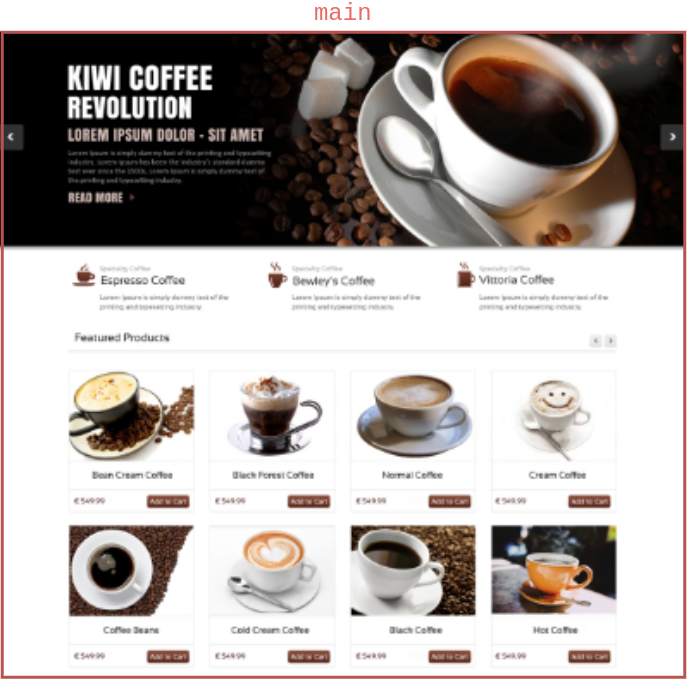
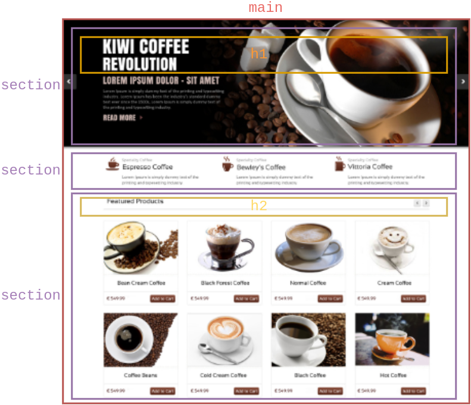
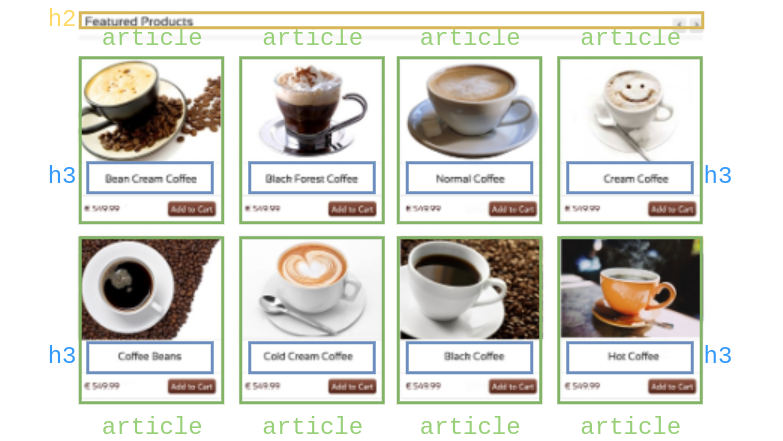
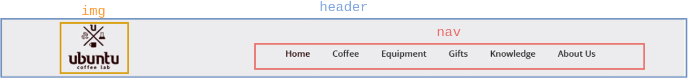
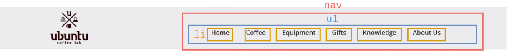
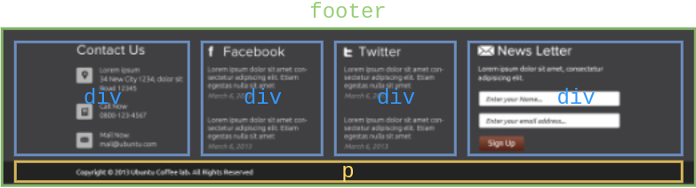

# HTML - Structure d'un site web 

Sylvain Schellenberger

## Principales parties <!-- .slide: class="split-panel-50-50" -->

```html
<body>
	<header></header>
	<main></main>
	<footer></footer>
</body>
```

 

## Le plus important <!-- .slide: class="split-panel-50-50" -->

```html
<main>
	<h1>Kiwi Coffee Revolution</h1>
	<p id="tagline">Lorem ipsum dolor - Sit amet</p>
</main>
```



Un seul `main`!

### Les sections <!-- .slide: class="split-panel-50-50" -->

```html
<main>
	<section>
		<h1>Kiwi Coffee Revolution</h1>
		<p id="tagline">Lorem ipsum dolor - Sit amet</p>
	</section>
	<section>
		<h2>Services</h2>
	</section>
	<section>
		<h2>Nos produits</h2>
	</section>
</main>
```



Un seul `h1` recommandé!

### Les articles

```html
<section>
	<h2>Nos produits</h2>
	<article>
		<h3>Pur Arabica</h3>
		
	</article>
	<article>
		<h3>Robusta</h3>
		
	</article>
</section>
```



## L'en-tête du site

```html [2-4]
<body>
	<header>
		
	</header>
	<nav>
	</nav>
</body>
```



### La navigation 

```html [3-7]
<header>
	
	<nav>
		<ul>
			<li><a href="a-propos.html">A Propos</a></li>
		</ul>
	<nav>
</header>
```



### Les ancres <!-- .slide: class="split-panel-50-50" -->

```html
<ul>
	<li><a href="#accueil">Accueil</a></li>
	<li><a href="#produits">Produits</a></li>
</ul>

<section id="accueil">
	<h1>Kiwi Coffee Revolution</h1>
</section>
<section id="produits">
	<h2>Nos produits</h2>
</section>
```


## Pied de page

```html
<footer>
	<div id="adress"></div>
	<div id="facebook-feed"></div>
	<div id="twitter-feed"></div>
	<div id="newsletter"></div>
	<p id="copyright">&copy; Kiwi Coffee Revolution 2021</p>
</footer>
```



### Navigation de pied de page

```html
<footer>
	<nav>
		<li><a href="#">Accueil</a></li>
	</nav>
</footer>
```

## Ressources

- Structure de site Web et de document, Mozilla Developers Network, [https://developer.mozilla.org/fr/docs/Learn/HTML/Introduction_to_HTML/Document_and_website_structure](https://developer.mozilla.org/fr/docs/Learn/HTML/Introduction_to_HTML/Document_and_website_structure)