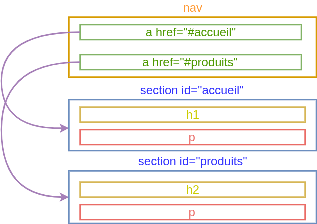

# HTML - Structure d'un site web

## Principales parties

```html
<body>
	<header></header>
	<main></main>
	</aside><aside>
	<footer></footer>
</body>
```


## Le plus important

```html
<main>
	<h1>Neskawa</h1>
	<p id="tagline">Du bon Kawa</p>
</main>
```

Un seul `main`!

### Les sections

```html [4-9]
<main>
	<h1>Neskawa</h1>
	<p id="tagline">Du bon Kawa</p>
	<section>
		<h2>Nos produits</h2>
	</section>
	<section>
		<h2>Avis consommateurs</h2>
	</section>
</main>
```

Un seul `h1` recommandé!

### Les articles

```html [3-10]
<section>
	<h2>Nos produits</h2>
	<article>
		<h3>Pur Arabica</h3>
		
	</article>
	<article>
		<h3>Robusta</h3>
		
	</article>
</section>
```

### Les conteneurs indéfinis

```html [3,12]
<section>
	<h1>Nos produits</h1>
	<div class="liste-produits">
		<article>
			<h2>Pur Arabica</h2>
			
		</article>
		<article>
			<h2>Robusta</h2>
			
		</article>
	</div>
</section>
```

### Les en-têtes de section

```html [2-4]
<section>
	<header>
		<h2>Nos produits</h2>
	</header>
	<div class="liste-produits">
		<article>
			<h3>Pur Arabica</h3>
			
		</article>
	</div>
</section>
```

## L'en-tête du site

```html [2-4]
<body>
	<header id="site-header">
		
	</header>
</body>
```

### La navigation

```html [3-7]
<header>
	
	<nav>
		<ul>
			<li><a href="#produits">Produits</a></li>
		</ul>
	<nav>
</header>
```

### Les ancres

```html
<ul>
	<li><a href="#produits">Produits</a></li>
	<li><a href="#avis">Avis</a></li>
</ul>
```

```html
<section id="produits">
</section>
<section id="avis">
</section>
```

###



## Pied de page

```html
<footer id="site-footer">
	<p id="copyright">&copy; Neskawa 2021</p>
</footer>
```

### Navigation de pied de page

```html
<footer id="site-footer">
	<nav>
		<li><a href="#">Accueil</a></li>
	</nav>
</footer>
```