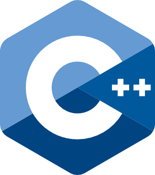

# Initiation Javascript

<div class="row r-stretch">

<div class="r-stack">


 <!-- .element: class="fragment" -->

</div>


</div>

Sylvain Schellenberger

## Un langage interprété ...

<div class="row r-stretch">

<div class="r-stack">


 <!-- .element: class="fragment" data-fragment-index="1" -->

<div class="fragment" data-fragment-index="3">




</div>

</div>

<div class="r-stack">


<div class="fragment" data-fragment-index="2">


</div>

</div>

</div>

## ... par le navigateur <!-- .slide: class="split-panel-50-50" -->


## Normalisé


Version courante: **EcmaScript 12** (Juin 2021)

## Implémenté inégalement

<div class="row r-stretch">


</div>

[caniuse.com/](https://caniuse.com/?search=Ecmascript)

## Exemples d'applications

- [salaire-brut-en-net.fr](https://www.salaire-brut-en-net.fr/)
- [canva.com](https://www.canva.com/fr_fr/)
- [discord.com](https://discord.com/)

## Ecrire du Javascript

```html
<script>
	console.log('Hello World!')
</script>
```

## Lier un fichier de script

index.html:

```html
<script src="main.js"></script>
```

main.js: 

```javascript
console.log('Hello World!')
```

## Ressources

- Mozilla Developers NetWork, [developer.mozilla.org/fr/docs/Web/JavaScript](https://developer.mozilla.org/fr/docs/Web/JavaScript)
- Free Code Camp, [freecodecamp.org/learn/javascript-algorithms-and-data-structures/](https://www.freecodecamp.org/learn/javascript-algorithms-and-data-structures/)

## Entraînement

CodinGame:

- Introduction: [codingame.com/training/easy/onboarding](https://www.codingame.com/training/easy/onboarding)
- Boucles: [codingame.com/training/easy/the-descent](https://www.codingame.com/training/easy/the-descent)
- Conditions: [codingame.com/training/easy/power-of-thor-episode-1](https://www.codingame.com/training/easy/power-of-thor-episode-1)
- Tableaux: [codingame.com/training/easy/ascii-art](https://www.codingame.com/training/easy/ascii-art)


