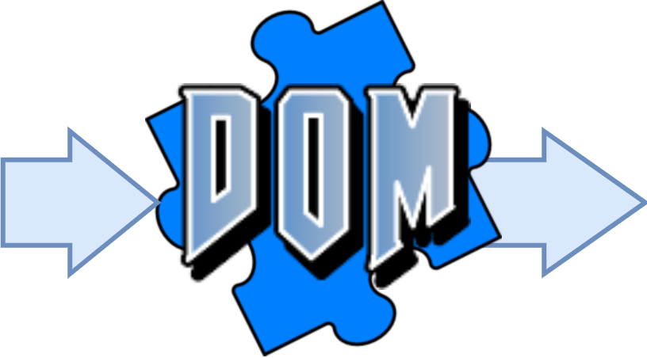
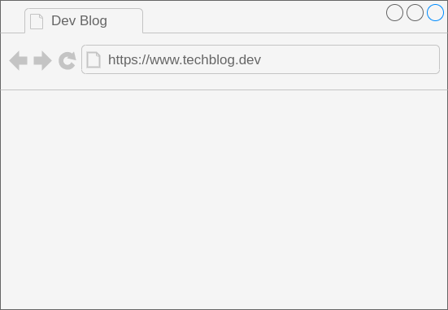
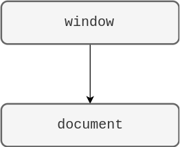
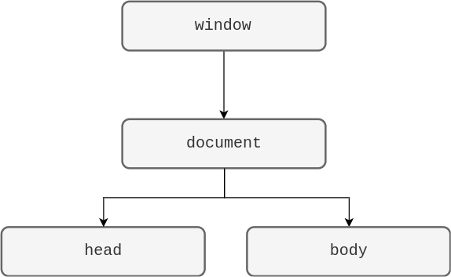
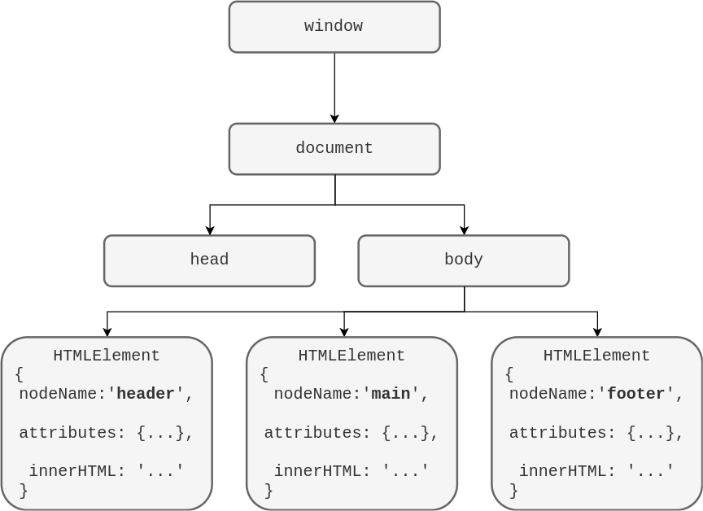
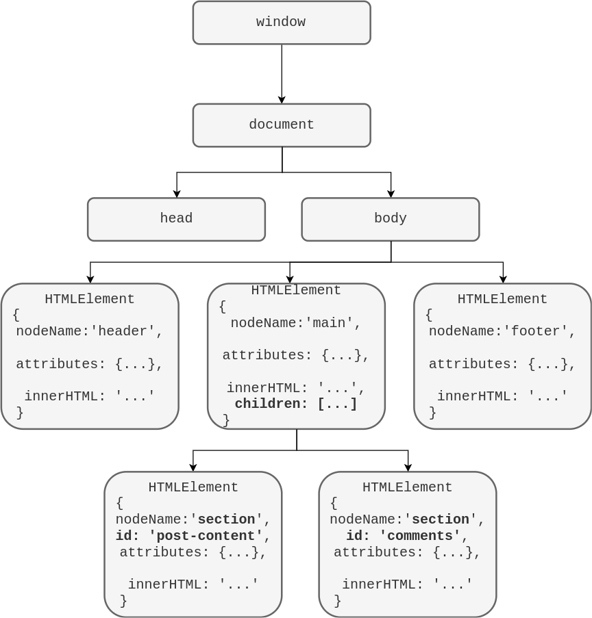

# Javascript et le DOM

Sylvain Schellenberger

## DOM d'API

<div class="row r-stretch">

 

 <!-- .element: class="fragment" -->


</div>

API = **A**pplication **P**rogramming **I**nterface

DOM = **D**ocument **O**bject **M**odel

## Un structure arborescente <!-- .slide: class="split-panel-50-50" -->

<div class="r-stack">

 <!-- .element: class="fragment current-visible" data-fragment-index="0" -->

<div class="fragment current-visible" data-fragment-index="1">

```html
<html>
</html>
```

</div>

<div class="fragment current-visible" data-fragment-index="2">

```html
<head>
</head>

<body>
</body>
```

</div>

<div class="fragment current-visible" data-fragment-index="3">

```html
<header>
</header>

<main>
</main>

<footer>
</footer>
```

</div>

<div class="fragment current-visible" data-fragment-index="4">

```html
<section id="post-content">
</section>

<section id="comments">
</section>
```

</div>

</div>
<div class="r-stack r-stretch">

 <!-- .element class="fragment current-visible" data-fragment-index="0" -->

 <!-- .element class="fragment current-visible" data-fragment-index="1" -->

 <!-- .element class="fragment current-visible" data-fragment-index="2" -->

 <!-- .element class="fragment current-visible" data-fragment-index="3" -->

 <!-- .element class="fragment current-visible" data-fragment-index="4" -->

</div>

## Sélectionner un élément par son identifiant

```javascript
const slideTitle = document.getElementById('sélectionner-un-élément')

const slideTitle2 = document.querySelector('#sélectionner-un-élément')

slideTitle === slideTitle2 // true
```

## Sélectionner des éléments par leur type

```javascript
const slideTitles = document.getElementsByTagName('h2')
```

```javascript
const slideTitles = document.querySelectorAll('h2')
```

```javascript
slideTitles.item(0) === slideTitles[0]
```

## Sélectionner des éléments par leur classe

```javascript
const codeBlocks = document.getElementsByClassName('code-wrapper')
```

```javascript
const codeBlocks = document.querySelectorAll('.code-wrapper')
```

## Sélectionner des éléments enfants

```javascript
const currentSlide = document.getElementById('slide-08')
const currentCodeWrappers = currentSlide.getElementsByClassName('code-wrapper')
```

```javascript
const currentCodeWrappers = document.querySelectorAll('#slide-08 pre')
```

## Récupérer la valeur d'un attribut

```javascript
slideTitle.id
```

```javascript
slideTitle.getAttribute('id')
```

## Modifier les attributs d'un élément

```javascript
slideTitle.id = 'edit-attribute'
```

```javascript
slideTitle.setAttribue('id', 'change-attribute')
```
## Changer le style d'un élément

```javascript
slideTitle.style = 'color: blue;'
```

```javascript
slideTitle.setAttribute('style', 'color: red;')
```

## Changer la/les classe(s) d'un élément

```javascript
slideTitle.className = 'r-frame'
```

```javascript
slideTitle.setAttribute('class', 'another-class')
```

```javascript
slideTitle.classList.add('r-frame')
```

## Modifier le contenu textuel d'un élément

```javascript
slideTitle.innerText = 'Bonjour tout le monde'
```

## Modifier plusieurs éléments

```javascript
const codeWrappers = document.getElementsByClassName('code-wrapper')

for (let i = 0; i < codeWrappers.length; i++) {
	const currentWrapper = codeWrappers[i]
	currentWrapper.classList.add('r-frame')
}
```

## A vous de jouer

- [https://github.com/raaaahman/dom-basics/releases/tag/v1.0.0](https://github.com/raaaahman/dom-basics/releases/tag/v1.0.0) (Exercice 1)

Mozilla Developers Network:

- [https://developer.mozilla.org/fr/docs/Web/API/Document_Object_Model/Introduction#types_de_donn%C3%A9es_fondamentaux](https://developer.mozilla.org/fr/docs/Web/API/Document_Object_Model/Introduction#types_de_donn%C3%A9es_fondamentaux)
- [https://developer.mozilla.org/fr/docs/Web/API/Document_object_model/Locating_DOM_elements_using_selectors](https://developer.mozilla.org/fr/docs/Web/API/Document_object_model/Locating_DOM_elements_using_selectors)

---

# Ajouter / enlever des éléments au DOM

Sylvain Schellenberger

## Retirer un élément

```javascript
const slide = document.getElementsByClassName('present').item(1)
const slideTitle = slide.getElementsByTagName('h2').item(0)
```

```javascript
slide.removeChild(slideTitle)
```

```javascript
slideTitle.remove()
```

## Ajouter un élément (dernier enfant)

```javascript
const slide2 = document.getElementsByClassName('present').item(1)

slide2.append(slideTitle)
```

## Ajouter un élément (après)

```javascript
const slideTitle2 = document.getElementById('ajouter-un-élément-après')

slideTitle2.after(slideTitle)
```

## Ajouter un élément (premier enfant)

```javascript
const slide3 = document.getElementsByClassName('present').item(1)

slide3.prepend(slideTitle)
```

## Ajouter un élément (avant)

```javascript
const slideTitle3 = document.getElementById('ajouter-un-élément-avant')

slideTitle3.before(slideTitle)
```

## Créer un nouvel élément

```javascript
const newP = document.createElement('p')
newp.innerText = 'Bonjour tout le monde!'
```

## A vous de jouer

- [https://github.com/raaaahman/dom-basics/releases/tag/v1.0.0](https://github.com/raaaahman/dom-basics/releases/tag/v1.0.0) (Exercice 2)

Mozilla Developers Network:

- [https://developer.mozilla.org/fr/docs/Web/API/Document_object_model/How_to_create_a_DOM_tree](https://developer.mozilla.org/fr/docs/Web/API/Document_object_model/How_to_create_a_DOM_tree)

---

# Gérer les évènements

## Ecouteur d'évènement

```javascript
const slideTitle = document.getElementById('ecouteur-dévènement')

// Fonction de rappel
function onClicked() { 
	console.log('clicked!')
}
	
slideTitle.addEventListener(
	'click', // Nom de l'événement
	onClicked // Référence à la fonction à appeler
)
```

## Ecouteur d'évènement (fonction anonyme)

```javascript
document.getElementById('ecouteur-dévènement-fonction-anonyme').addEventListener(
	'click',
	function () {
		console.log('clicked again!)
	}
)
```
## L'objet Event

```javascript
document.getElementById('lobjet-event').addEventListener(
	'click',
	function(event) {
		console.log(event)
	}
)
```

## Cible de l'évènement

```javascript
document.getElementById('cible-de-lévènement').addEventListener(
	'click',
	function(event) {
		console.log(event.target)
	}
)
```

## Enlever un écouteur d'évènement

```javascript
function (clickLogger) {
	console.log('clicked!')
}

const slideTitle2 = document.getElementById('enlever-un-écouteur-dévènement')

slideTitle2.addEventListener(
	'click',
	clickLogger
)

slideTitle2.removeEventListener('click', clickLogger)
```

## A vous de jouer

- [https://github.com/raaaahman/dom-basics/releases/tag/v1.0.0](https://github.com/raaaahman/dom-basics/releases/tag/v1.0.0) (Exercice 3)

Mozilla Developers Network:

- [https://developer.mozilla.org/fr/docs/Learn/JavaScript/Building_blocks/Events](https://developer.mozilla.org/fr/docs/Learn/JavaScript/Building_blocks/Events)


