# Gestion des évènements en Javascript

Sylvain Schellenberger

## Spécification DOM Level 2 Core

<div class="r-stack r-stretch">

 <!-- .element: class="fragment current-visible" -->

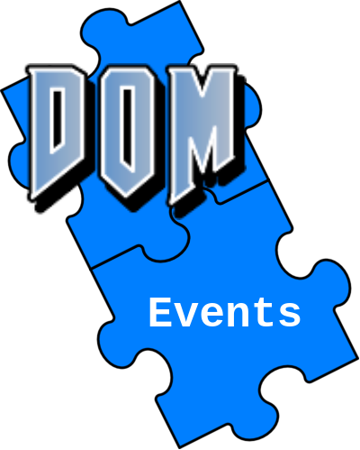 <!-- .element: class="fragment" -->

</div>

Norme W3C: [www.w3.org/TR/DOM-Level-2-Events/](https://www.w3.org/TR/DOM-Level-2-Events/)

## Processus en deux temps

<div class="row r-stretch">
	
<div class="fragment">

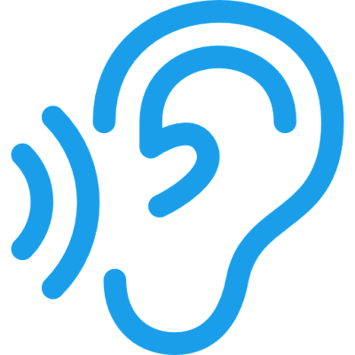

Ecouter

</div>

<div class="fragment">

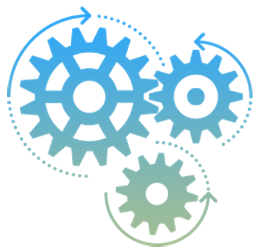

Réagir

</div>

</div>

## Ecouteur d'évènement

```javascript
const slideTitle = document.getElementById('ecouteur-dévènement')

// Fonction de rappel
function onClicked() { 
	console.log('clicked!')
}
	
slideTitle.addEventListener(
	'click', // Nom de l'événement
	onClicked // Référence à la fonction à appeler
)
```

## Quelques noms d'événements

- **click**: un clic de la souris
- **keypress**: appui sur un bouton du clavier
- **pointermove**: on bouge la souris
- **scroll**: Défilement de la page
- **submit**: Le formulaire a été envoyé

[Listing des événements, Mozilla Developers Network](https://developer.mozilla.org/fr/docs/Web/Events#listing_des_%C3%A9v%C3%A9nements)

## Ecouteur d'évènement (fonction anonyme)

```javascript
document.getElementById('ecouteur-dévènement-fonction-anonyme').addEventListener(
	'click',
	function () {
		console.log('clicked again!)
	}
)
```

## L'objet Event

```javascript
document.getElementById('lobjet-event').addEventListener(
	'click',
	function(event) {
		console.log(event.type)
		console.log(event.timeStamp)
	}
)
```

[Référence de l'objet Event, Mozilla Developers Network](https://developer.mozilla.org/fr/docs/Web/API/Event)

## Cible de l'évènement

```javascript
document.getElementById('cible-de-lévènement').addEventListener(
	'click',
	function(event) {
		console.log(event.target)
		event.target.style.color = 'red'
	}
)
```

## Bloquer le comportement par défaut

<form>
	<input type="text" name="texte">
	<button type="submit">Envoyer</button>
</form>

```javascript
const myForm = document.getElementsByTagName('form')[0]

myForm.addEventListener(
	'submit',
	function (event) {
	
		event.preventDefault()
		
	}
)
```

## Récupérer les données du formulaire

<form>
	<input type="text" name="texte">
	<button type="submit">Envoyer</button>
</form>

```javascript
const myForm2 = document.getElementsByTagName('form')[0]

myForm2.addEventListener( 'submit', formLogger )

function formLogger(event) {
		event.preventDefault()
		
		const textInput = event.target.getElementsByTagName('input')[0]
		console.log(textInput.value)
	}
)
```

## Enlever un écouteur d'évènement

```javascript
let nombre = 0
function clickLogger() {
	nombre++
	console.log('cliqué ' + nombre + ' fois')
}

const slideTitle2 = document.getElementById('enlever-un-écouteur-dévènement')

slideTitle2.addEventListener('click', clickLogger)

slideTitle2.removeEventListener('click', clickLogger)
```

## A vous de jouer

- [https://github.com/raaaahman/dom-basics/releases/tag/v1.0.0](https://github.com/raaaahman/dom-basics/releases/tag/v1.0.0) (Exercice 3)

Mozilla Developers Network:

- [https://developer.mozilla.org/fr/docs/Learn/JavaScript/Building_blocks/Events](https://developer.mozilla.org/fr/docs/Learn/JavaScript/Building_blocks/Events)
- [https://developer.mozilla.org/fr/docs/Web/Events#listing_des_événements](https://developer.mozilla.org/fr/docs/Web/Events#listing_des_%C3%A9v%C3%A9nements)

---

# Propagation des événements

Sylvain Schellenberger

## Quelle fonction va être appelée?

<div class="row">

```html
<div id="feed">
    <h2>My Feed:</h2>
    <div class="feed-msg">
        <h3>Message:</h3>
        
        <p class="msg-comment">Hello World!</p>
    </div>
</div>
```

```javascript
document.getElementById('feed')
.addEventListener( 'click',
    function() { console.log('Feed') }
)

document.getElementsByClassName('feed-msg')[0]
.addEventListener( 'click',
    function ) { console.log('Message') }
)

document.getElementsByClassName('msg-comment')[0]
.addEventListener( 'click',
    function() { console.log('Comment') }
)
```

</div>

## Phase de Bouillonnement

<div class="r-stack">

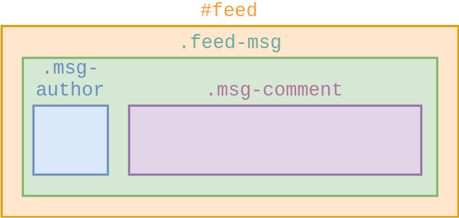 <!-- .element: class="fragment current-visible" -->

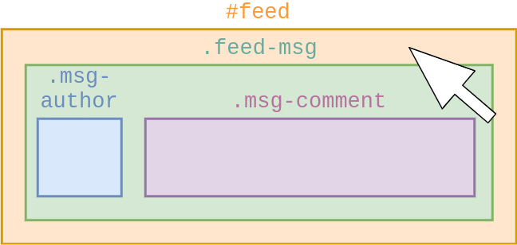 <!-- .element: class="fragment current-visible" -->

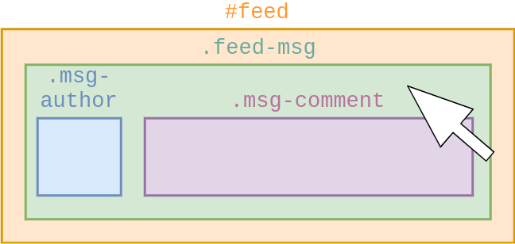 <!-- .element: class="fragment current-visible" -->

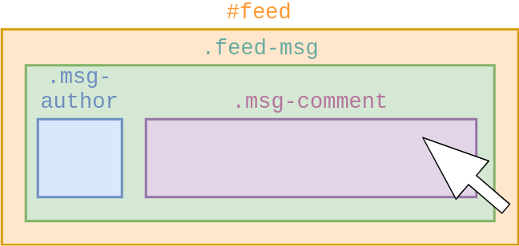 <!-- .element: class="fragment current-visible" -->

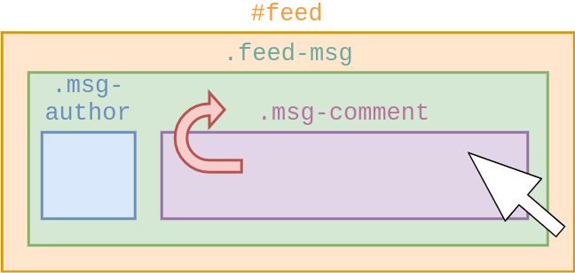 <!-- .element: class="fragment current-visible" -->

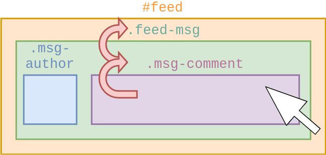 <!-- .element: class="fragment current-visible" -->

</div>

## Phase de Capture

```javascript
document.getElementById('feed').addEventListener( 
	'click',
    function() { console.log('Feed') }
    true // Autorise la phase de capture
)
```

Désactivé par défaut

## Capture + Bouillonnement

<div class="r-stack">

 <!-- .element: class="fragment current-visible" -->

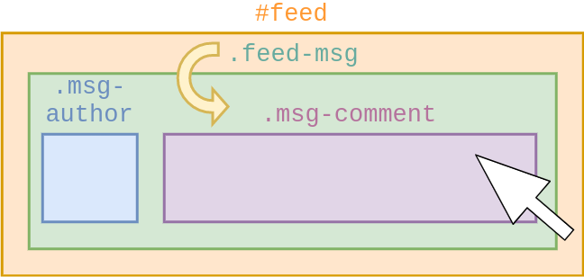 <!-- .element: class="fragment current-visible" -->

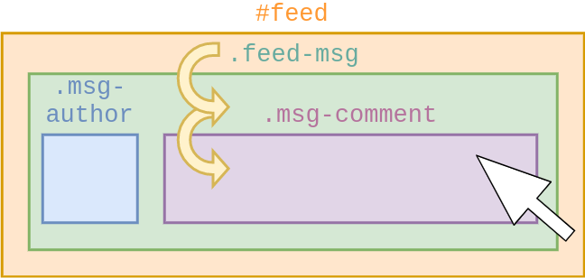 <!-- .element: class="fragment current-visible" -->

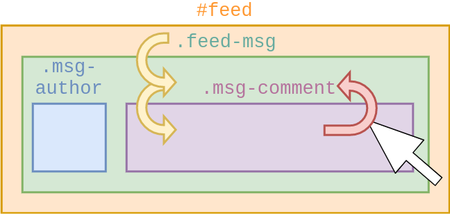 <!-- .element: class="fragment current-visible" -->

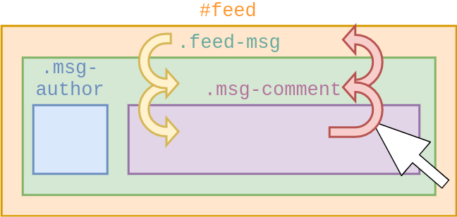 <!-- .element: class="fragment current-visible" -->

</div>