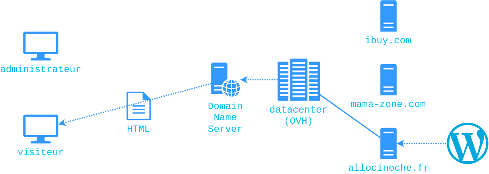
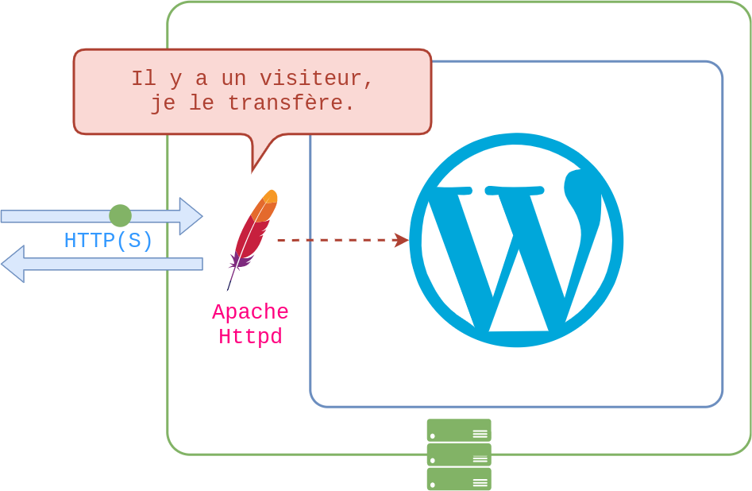
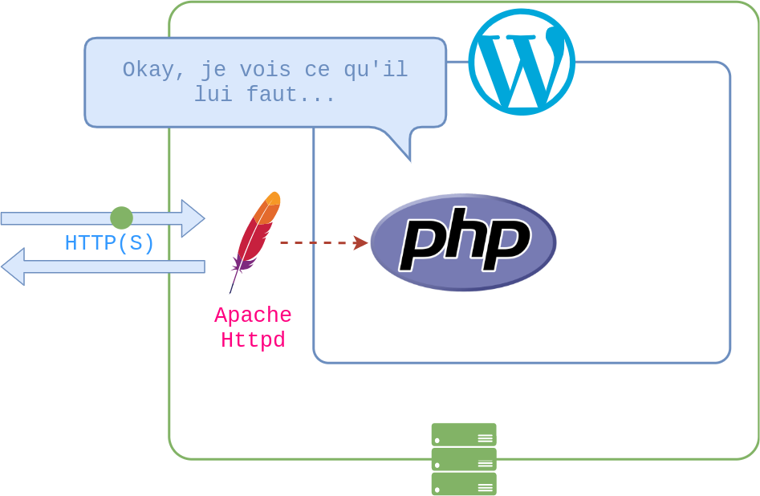
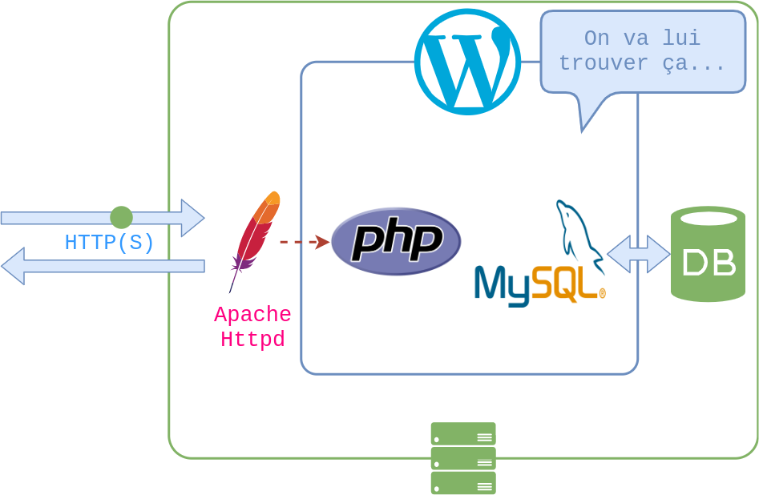
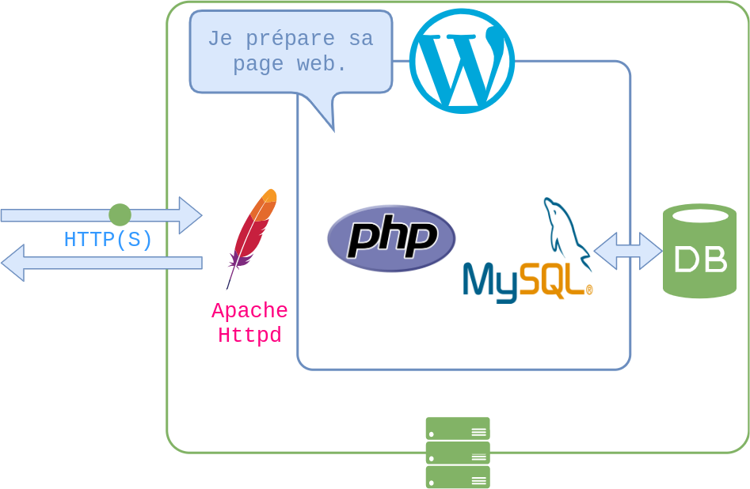
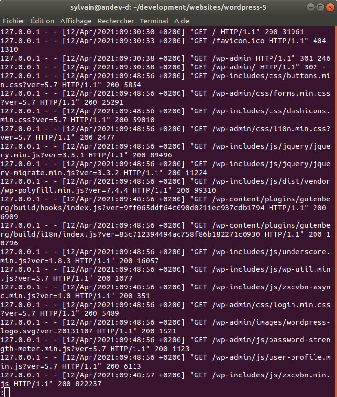

# WordPress et les sites web dynamiques

Sylvain Schellenberger

## Mon expérience 

- 2.5 ans Développeur pour Polylang (extension WordPress)

## Sites statiques

<!-- .element: class="r-stretch" -->

HTML + CSS (+ Javascript)

## Sites dynamique (le réseau)

 <!-- .element: class="fragment current-visible" -->

 <!-- .element: class="fragment current-visible" -->

 <!-- .element: class="fragment current-visible" -->

 <!-- .element: class="fragment current-visible" -->

 <!-- .element: class="fragment current-visible" -->

 <!-- .element: class="fragment current-visible" -->

 <!-- .element: class="fragment current-visible" -->

 <!-- .element: class="fragment current-visible" -->

## Site Dynamique (WordPress)

<!-- .element: class="fragment current-visible" data-fragment-index="0" -->

<!-- .element: class="fragment current-visible" data-fragment-index="1" -->

<!-- .element: class="fragment current-visible" data-fragment-index="2"  -->

<!-- .element: class="fragment current-visible" data-fragment-index="3" -->

<!-- .element: class="fragment current-visible" data-fragment-index="4" -->

<!-- .element: class="fragment"  data-fragment-index="5" -->

## La "stack"

 <!-- .element: class="fragment" data-fragment-index="0" -->

 <!-- .element: class="fragment" data-fragment-index="2" -->

(Windows / MacOS / Linux) + Apache + ( MySQL / MariaDB ) + Php

 
## Apache Httpd + PHP

<!-- .element: style="max-width: 100%; max-height: 100%" -->

<!-- .element: style="max-width: 100%; max-height: 100%" -->

## MySQL + PHPMyAdmin

<!-- .element: style="max-width: 100%; max-height: 100%" -->

<!-- .element: style="max-width: 100%; max-height: 100%" -->
 

## Ressources (outils)

- WordPress (Open Source): [wordpress.org](https://wordpress.org/)
- WordPress (Auttomatic): [wordpress.com](https://wordpress.com/fr/) 
- Xamp (Open Source): [apachefriends.org](https://www.apachefriends.org/fr/index.html)
- LocalWP (FlyWheel): [localwp.com](https://localwp.com/)

## Ressources (tutoriels)

- WP Marmite (utilisateurs): [wpmarmite.com](https://wpmarmite.com/)
- Capitaine WP (développeurs): [capitainewp.io](https://capitainewp.io/)
- WordPress Aix-en-Provence (Meet Up): [meetup.com/fr-FR/Meetup-WordPress-Aix-en-Provence/](https://www.meetup.com/fr-FR/Meetup-WordPress-Aix-en-Provence/)