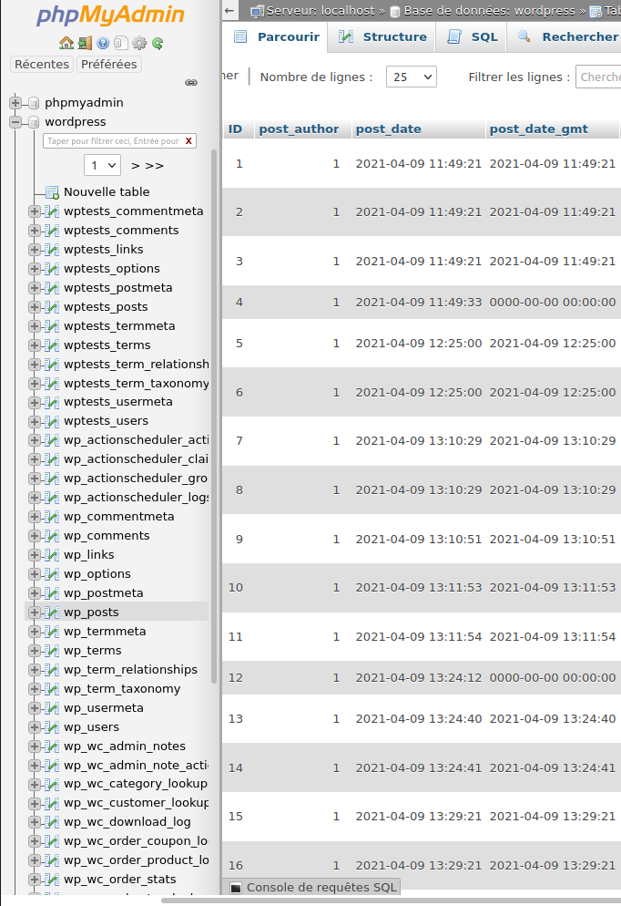

# PHP et les sites web dynamiques

Sylvain Schellenberger

## Mon expérience 

- 2.5 ans Développeur pour Polylang

## Sites statiques

<!-- .element: class="r-stretch" -->

HTML + CSS (+ Javascript)

## WordPress (site dynamique)

<!-- .element: class="r-stretch" -->

???

## A l'intérieur de WordPress

<!-- .element: class="fragment current-visible" data-fragment-index="0" -->

<!-- .element: class="fragment current-visible" data-fragment-index="1" -->

<!-- .element: class="fragment current-visible" data-fragment-index="2"  -->

<!-- .element: class="fragment current-visible" data-fragment-index="3" -->

<!-- .element: class="fragment current-visible" data-fragment-index="4" -->

<!-- .element: class="fragment"  data-fragment-index="5" -->

## La "stack"

(**W**indows / **M**acOS / **L**inux) + **A**pache + ( **M**ySQL / **M**ariaDB ) + **P**HP
 
## 

<!-- .element: style="max-width: 100%; max-height: 100%" -->

<!-- .element: style="max-width: 100%; max-height: 100%" -->

<!-- .element: style="max-width: 100%; max-height: 100%" -->

<!-- .element: style="max-width: 100%; max-height: 100%" -->
 

