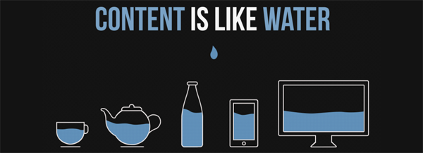
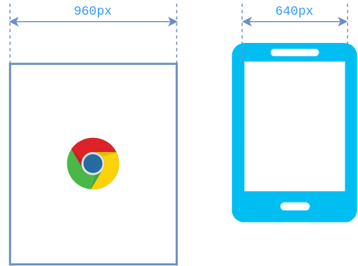
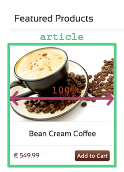

# Responsive Web Design



Sylvain Schellenberger

## Tailles d'écrans


Liste des résolutions communes d'écrans: [https://experienceleague.adobe.com/docs/target/using/experiences/vec/mobile-viewports.html?lang=fr](https://experienceleague.adobe.com/docs/target/using/experiences/vec/mobile-viewports.html?lang=fr)

## Fenêtre du navigateur


<!-- .element: class="r-stretch" -->

```html
<meta name="viewport" content="width=device-width, initial-scale=1">
```

## Centrer le site <!-- .slide: class="split-panel-50-50" -->

<div>

```html
<header>
	<div class="container">
	</div>
</header>
<main>
	<div class="container">
	</div>
</main>
<footer>
	<div class="container">
	</div>
</footer>
```

```css
.container {
	max-width: 960px;
	margin: auto;
}
```

</div>


## Adapter les images <!-- .slide: class="split-panel-50-50" -->

<div>

```html
<article>
	
</article>
```

```css
img {
	widt: 100%;
}
```

</div>



## Vue adaptive (navigateur)

`Menu > Plus d'outils > Outils de développement > Inspecteur > Vue adaptive`

OU `Ctrl + Maj + M` (Firefox)

## Media queries

```css
@media screen and (min-width: 960px) {
	article {
		flex-basis: 33%;
	}
}
```

Media queries, Mozilla Developers Network, [https://developer.mozilla.org/fr/docs/Web/CSS/Media_Queries/Using_media_queries](https://developer.mozilla.org/fr/docs/Web/CSS/Media_Queries/Using_media_queries)

## Exemple <!-- .slide: class="split-panel-50-50" -->

```css
/* Pour les mobiles */
article {
	flex-basis: 100%;
}

/* Pour les tablettes */
@media screen and (min-width: 768px) {
	article {
		flex-basis: 50%;
	}
}

/* Pour les moniteurs */
@media screen and (min-width: 960px) {
	article {
		flex-basis: 33%;
	}
}
```


## Tailles de polices relatives

```css
html {
    font-size: 1em;
}
h1 {
    font-size: 2rem;
}
@media screen and (min-width: 900px) {
	h1 {
		font-size: 4rem;
	}
}
p {
    font-size: 1rem;
}
```

## Ressources

Responsive Design, Mozilla DEvelopers Network, [https://developer.mozilla.org/fr/docs/Learn/CSS/CSS_layout/Responsive_Design](https://developer.mozilla.org/fr/docs/Learn/CSS/CSS_layout/Responsive_Design)

---

# Meilleure gestion du responsive

Sylvain Schellenberger

## Fonctionnalité disponibles

```css
@media screen and (hover: hover) {
	a:hover {
		background-color: coral;
	}
}
```

<iframe srcdoc="
<head>
	<style>
		@media screen and (hover: hover) {
			a:hover {
				background-color: coral;
			}
		}
	</style>
</head>
<body>
	<a href=google.com >Click me!</a>
</body>"></iframe>

Media queries, Mozilla Developers Network, [https://developer.mozilla.org/fr/docs/Web/CSS/Media_Queries/Using_media_queries](https://developer.mozilla.org/fr/docs/Web/CSS/Media_Queries/Using_media_queries)

## Charger des images adaptées

```html
<picture>
  <source 
    srcset="https://via.placeholder.com/320"
    media="(min-width: 960px)"
  />
  <source 
    srcset="https://via.placeholder.com/384"
    media="(min-width: 768px)"
  />
  
</picture>
```

A guide to responsive images, CSS Ticks, [https://css-tricks.com/a-guide-to-the-responsive-images-syntax-in-html/#using-picture](https://css-tricks.com/a-guide-to-the-responsive-images-syntax-in-html/#using-picture)

## Vérifier le support par les navigateurs

[https://caniuse.com/](https://caniuse.com/)

## Utiliser des polyfills

- Comprendre les Polyfills, la-cacade.io, [https://la-cascade.io/html5-comprendre-les-polyfills-shivs-et-shims/](https://la-cascade.io/html5-comprendre-les-polyfills-shivs-et-shims/)
- Modernizr, Github, [https://github.com/Modernizr/Modernizr](https://github.com/Modernizr/Modernizr)
