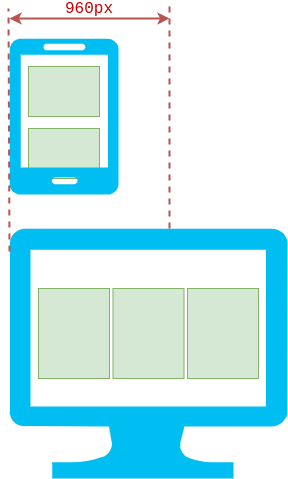
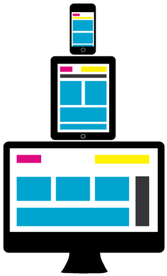

# Responsive Web Design


Sylvain Schellenberger

## Tailles d'écrans


Liste des résolutions communes d'écrans: [https://experienceleague.adobe.com/docs/target/using/experiences/vec/mobile-viewports.html?lang=fr](https://experienceleague.adobe.com/docs/target/using/experiences/vec/mobile-viewports.html?lang=fr)

## Fenêtre du navigateur


<!-- .element: class="r-stretch" -->

```html
<meta name="viewport" content="width=device-width, initial-scale=1">
```

## Centrer le site <!-- .slide: class="split-panel-50-50" -->

<div>

```html
<header>
	<div class="container">
	</div>
</header>
<main>
	<div class="container">
	</div>
</main>
<footer>
	<div class="container">
	</div>
</footer>
```

```css
.container {
	max-width: 960px;
	margin: auto;
}
```

</div>


## Adapter les images <!-- .slide: class="split-panel-50-50" -->

<div>

```html
<article>
	
</article>
```

```css
img {
	width: 100%;
}
```

</div>


## Tailles de polices relatives <!-- .slide: class="split-panel-50-50" -->

```css
body {
	/* On laisse la taille par défaut, 
	ou celle modifiée par l'utilisateur. */
}

header {
    font-size: 2rem;
    /* Deux fois la taille de base. */
    padding: 1em;
    /* 1 fois la taille de la police */
}

footer {
	font-size: 0.5rem;
	/* moitié de la taille de base */
	padding: 4em;
	/* 4 fois la taille de la police */
}
```

<iframe srcdoc="<head>
<style>
header {
	text-align: center;
    font-size: 2rem;
    padding: 1em 0;
    background-color: darkgrey;
}
main {
	padding: 2em 0;
}
footer {
	text-align: center;
	font-size: 0.5rem;
	padding: 4em 0;
	background-color: darkgrey;
}
h1, p {
	margin: 0;
}
</style>
</head>
<body>
	<header>
		<h1>Hello World</h1>
		<p>And welcome to my blog.</p>
	</header>
	<main>
		<p>Bla bla...</p>
	</main>
	<footer>
		<p>2020-2021 &copy; Sylvain Schellenberger</p>
	</footer>
</body>
">
	
</iframe>

## Vue adaptive (navigateur)

`Menu > Plus d'outils > Outils de développement > Inspecteur > Vue adaptive`

OU `Ctrl + Maj + M` (Firefox)

## Les requêtes médias <!-- .slide: class="split-panel-50-50" -->

```css
@media screen and (min-width: 960px) {
	article {
		displat: inline-block;
		width: 33%;
	}
}
```



## Exemple <!-- .slide: class="split-panel-50-50" -->

```css
/* Pour les mobiles */
article {
	display: block;
	width: 100%;
}

/* Pour les tablettes */
@media screen and (min-width: 768px) {
	article {
		display: inline-block;
		width: 50%;
	}
}

/* Pour les moniteurs de bureau */
@media screen and (min-width: 960px) {
	article {
		width: 33%;
	}
}
```



## D'autres requêtes média

```css
@media screen and (min-width: 900px) {
	h1 {
		font-size: 4rem;
	}
}
```

```css
@media print {
	* {
		background-color: white !important;
		color: black !important;
	}
}
```

## Ressources (outils)

- Experience mobile, Google Search Console, [search.google.com/search-console/page-experience](https://search.google.com/search-console/page-experience)
- Test d'optimisation mobile, Google Search Console, [https://search.google.com/test/mobile-friendly/](https://search.google.com/test/mobile-friendly/)
- Google Lighthouse, Chrome Web Store, [chrome.google.com/webstore/detail/lighthouse/blipmdconlkpinefehnmjammfjpmpbjk](https://chrome.google.com/webstore/detail/lighthouse/blipmdconlkpinefehnmjammfjpmpbjk)

## Ressources (documentation)

- Responsive Design, Mozilla DEvelopers Network, [https://developer.mozilla.org/fr/docs/Learn/CSS/CSS_layout/Responsive_Design](https://developer.mozilla.org/fr/docs/Learn/CSS/CSS_layout/Responsive_Design)
- font-size, Mozilla Developers Network, [developer.mozilla.org/fr/docs/Web/CSS/font-size](https://developer.mozilla.org/fr/docs/Web/CSS/font-size)
- Media queries, Mozilla Developers Network, [https://developer.mozilla.org/fr/docs/Web/CSS/Media_Queries/Using_media_queries](https://developer.mozilla.org/fr/docs/Web/CSS/Media_Queries/Using_media_queries)

---

# Meilleure gestion du responsive

Sylvain Schellenberger

## Fonctionnalité disponibles

```css
@media screen and (hover: hover) {
	a:hover {
		background-color: coral;
	}
}
```

<iframe srcdoc="
<head>
	<style>
		@media screen and (hover: hover) {
			a:hover {
				background-color: coral;
			}
		}
	</style>
</head>
<body>
	<a href=google.com >Click me!</a>
</body>"></iframe>

## Optimiser le chargement des images

```html [|1,3|2,4]

```

- `w` = largeur réelle de l'image 
- `px` = largeur affichée dans la page

## Changer l'image selon la taille d'écran

```html [|2-5|6-9|10-13]
<picture>
  <source 
    srcset="plan-large.jpg"
    media="(min-width: 960px)"
  />
  <source 
    srcset="plan-3-quart.jpg"
    media="(min-width: 768px)"
  />
  
</picture>
```

## Vérifier le support par les navigateurs

[https://caniuse.com/](https://caniuse.com/)

## Utiliser des polyfills

- Comprendre les Polyfills, la-cascade.io, [https://la-cascade.io/html5-comprendre-les-polyfills-shivs-et-shims/](https://la-cascade.io/html5-comprendre-les-polyfills-shivs-et-shims/)
- Modernizr, Github, [https://github.com/Modernizr/Modernizr](https://github.com/Modernizr/Modernizr)

## Ressources

- Media queries, Mozilla Developers Network, [https://developer.mozilla.org/fr/docs/Web/CSS/Media_Queries/Using_media_queries](https://developer.mozilla.org/fr/docs/Web/CSS/Media_Queries/Using_media_queries)
- Mozilla Developers Network, Images adaptives, [developer.mozilla.org/fr/docs/Learn/HTML/Multimedia_and_embedding/Responsive_images](https://developer.mozilla.org/fr/docs/Learn/HTML/Multimedia_and_embedding/Responsive_images)
