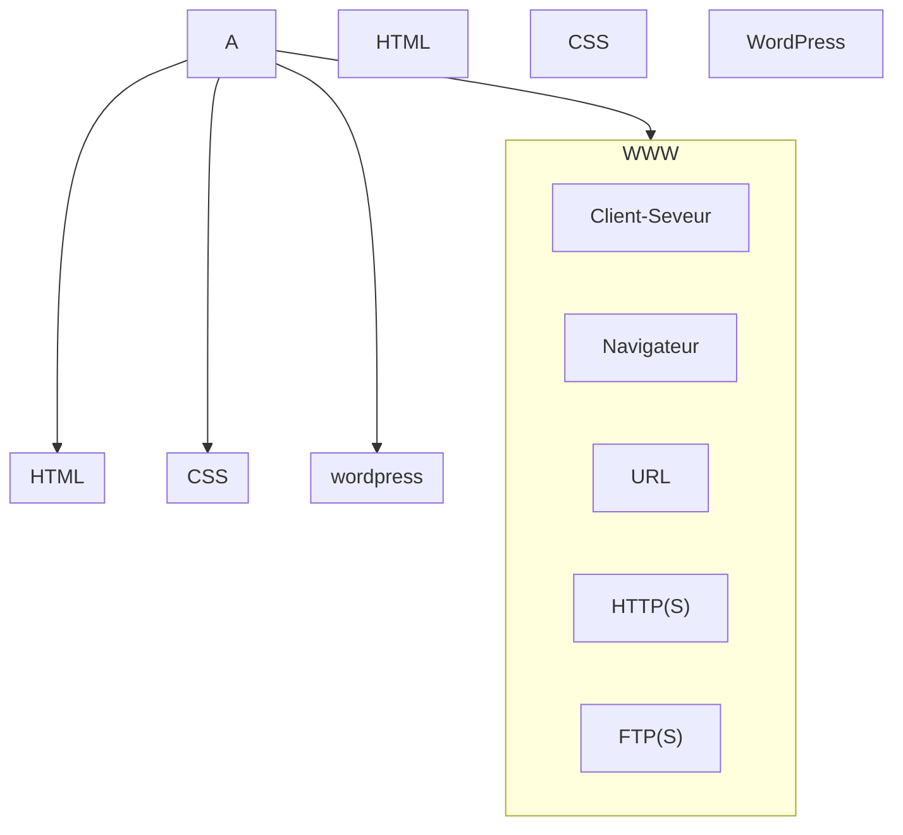

# Optimiser le HTML pour le référencement

Sylvain Schellenberger

## Stratégie de mots-clé

```mermaid[1|2-5]
graph TD
	A
	C[HTML]
	D[CSS]
	E[WordPress]

	subgraph WWW
		direction RL
		F["Client-Seveur"]
		G[Navigateur]
		H[URL]
		I["HTTP(S)"]
		K["FTP(S)"]
	end
	
	subgraph HTML
	
	end
	
	subgraph CSS
	
	end
	
	subgraph wordpress
	
	end
	
	A-->WWW
	A-->HTML
	A-->CSS
	A-->wordpress


```