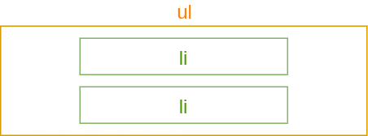
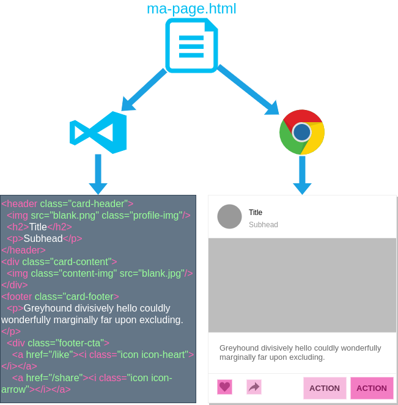
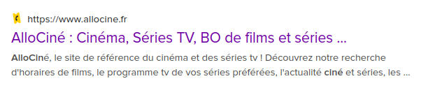
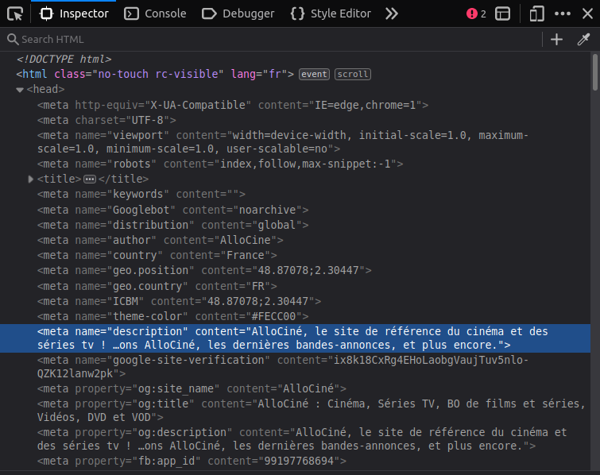
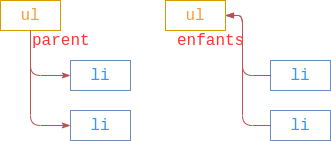
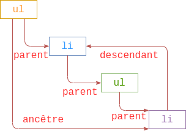
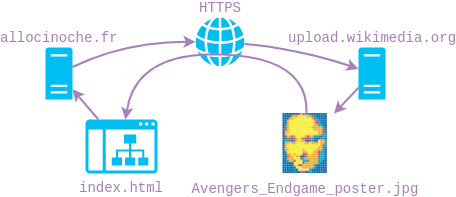
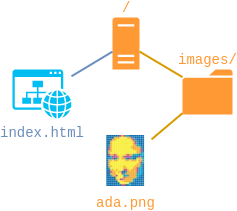
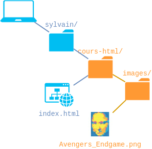

# HTML

Sylvain Schellenberger

Octobre 2021

## Quésaco?


**H**yper**T**ext **M**ark up **L**anguage ~= Language de balises hypertextes

Notes: Les pages html sont reliées entre elles par des **liens hypertextes** (ou hyperliens)

La syntaxe des documents HTMLs est consituté de **balises**

HTML est un **language de description** de documents

## Les éléments HTML

```html
<p>Cuisinier souriant</p>
```

<iframe style="background-color: #fff; overflow: visible" srcdoc="<p>Cuisinier Souriant</p>" style="background-color: #fff;">
</iframe>

Notes: Le navigateur interprète les balises et affiche uniquement le contenu.

## Les balises

- `<p>`: Une **balise ouvrante**
- `Cusinier souriant`: Un **contenu** (ici, du texte) 
- `</p>`: Une **balise fermante**

## Les titres

```html
<h1>Bob l'éponge</h1>
<h2>Sa vie</h2>
<h2>Son oeuvre</h2>
```

<iframe style="background-color: #fff; overflow: visible; min-height: 20vh;" srcdoc="<h1>Bob l'éponge</h1>
<h2>Sa vie</h2>
<h2>Son oeuvre</h2>">
</iframe>

Notes: Les titres donnent une indication sur le contenu de la page.

## Imbriquer les éléments



```html
<ul>
	<li>Habite à Bikini Bottom</li>
	<li>Travaille au Crabe Croustillant</li>
</ul>
```

Notes: La dernière balise ouverte est la première fermée.

## Mélanger texte et éléments

```html
<ul>
	<li>Habite à <strong>Bikini Bottom</strong></li>
	<li>Travaille au <strong>Crabe Croustillant</strong></li>
</ul>
```

<iframe style="background-color: #fff; overflow: visible;" srcdoc="<ul>
	<li>Habite à <strong>Bikini Bottom</strong></li>
	<li>Travaille au <strong>Crabe Croustillant</strong></li>
</ul>">
</iframe>

## Les attributs HTML

```html [1]
<a href="https://fr.wikipedia.org/wiki/Bob_l%27%C3%A9ponge,_le_film">
	Bob l'éponge, le film
</a>
```

<iframe style="background-color: #fff; overflow: visible;" srcdoc="<a href=https://fr.wikipedia.org/wiki/Bob_l%27%C3%A9ponge,_le_film_:_Un_h%C3%A9ros_sort_de_l%27eau target=_blank>
	Bob l'éponge, le film
</a>">
</iframe>

Notes:

- On renseigne une **adresse URL** dans l'attribut `href`
- L'attribut `target` défini où est ouverte la nouvelle page

## Les balises auto-fermantes

```html [4]

```

<iframe style="background-color: #fff; overflow: visible;" srcdoc="">
</iframe>

Notes:

- On peut écrire un `/` avant le dernier chevron (mais ce n'est pas obligatoire).
- On donne l'**adresse URL** où se situe l'image à l'attribut `src`
- `alt` décrit l'image pour les personnes non-voyantes

## Résultat

<iframe style="background-color: #fff; overflow: visible; width: 100%; height: 60vh;" 
		srcdoc="
				
				<h1>Bob l'éponge</h1>
				<p>Cuisinier souriant</p>
				<h2>Sa vie</h2>
				<ul>
					<li>Habite à <strong>Bikini Bottom</strong></li>
					<li>Travaille au <strong>Crabe Croustillant</strong></li>
				</ul>
				<h2>Son oeuvre</h2>
				<ol>
					<li><a href=https://fr.wikipedia.org/wiki/Bob_l%27%C3%A9ponge,_le_film target=_blank>Bob l'éponge, le film</a></li>
					<li><a href=https://fr.wikipedia.org/wiki/Bob_l%27%C3%A9ponge,_le_film_:_Un_h%C3%A9ros_sort_de_l%27eau  target=_blank>Un héros sort de l'eau</a></li>
					<li><a href=https://fr.wikipedia.org/wiki/Bob_l%27%C3%A9ponge,_le_film_:_%C3%89ponge_en_eaux_troubles  target=_blank>Eponge en eaux troubles</a></li>
				</ol>
			">
	</iframe>

## Récapitulatif

```html
<h1>Les titres de premier niveau</h1>
<h2>Les titres de second niveau</h2>
<p>Les paragraphes</p>
<ul>Les listes non ordonnées
	<li>Les éléments de liste</li>
</ul>
<ol>
	Les listes ordonnées
	<li>Les éléments de listes</li>
</ol>
<a href="https://la-cible.fr">Les liens hypertextes</a>

```

Mozilla Developer's Network - la référence HTML : [https://developer.mozilla.org/fr/docs/Web/HTML](https://developer.mozilla.org/fr/docs/Web/HTML)

## TP: La carte de visite

- Choisir une personne, une célébrité, un personnage de fiction, etc. à présenter.
- Aller sur [https://https://codepen.io/](https://codepen.io/) et cliquer sur "Start Coding"
- Créer sa carte de visite en HTML

---

# Bien former ses pages HTML

## Utiliser un éditeur de texte



##

Visual Studio Code / Sublime Text = Editeur de texte =/= Traitement de texte = Word

[Document texte](../assets/examples/richtext.docx)

- Sublime Text: [https://www.sublimetext.com/download](https://www.sublimetext.com/download)
- Visual Studio Code: [https://code.visualstudio.com/#alt-downloads](https://code.visualstudio.com/#alt-downloads)

## Le document HTML

```html
<!DOCTYPE html>
```

En **première ligne** du document.

Notes: On déclare que l'on va écrire du HTML.

## La balise html

```html [2,4]
<!DOCTYPE html>
<html lang="fr">

</html>
```

Englobe tout.

Notes: L'attribut "lang" aide le navigateur à identifier la langue de la page.

## L'en-tête du document

```html [2-4]
<html lang="fr">
	<head>
		<title>Bob l'éponge</title>
	</head>
</html>
```

Contient les informations destiné au **navigateur**.

Notes: La balise `title` indique le titre de la page, qui s'affiche dans l'onglet du navigateur.

## Les balises meta

```html [2]
<head>
	<meta charset="utf-8"/>
</head>
```

Notes: `charset` défini le **jeu de caractères** utilisé dans le document

Les balises `meta` sont auto-fermantes: tout se passe dans leurs attributs.

## Le corps du document 

```html [6-8]
<!DOCTYPE html>
<html>
	<head>
		<title>Bob l'éponge</title>
	</head>
	<body>
		<h1>Bob l'éponge</h1>
	</body>
</html>
```

Contient les informations destinées aux lecteurs de la page.

## Valider son HTML

Le World Wide Web Consortium (W3C) est l'organisme en charge de la rédaction des standards du web, notamment les URLS, HTML et CSS.

Validateur HTML: [https://validator.w3.org](/https://validator.w3.org/)

## TP: La carte de visite (partie 2)

- Ecrire un document HTML
- Récupérer le code HTML du premier TP et le copier dans le body
- Passer le code au validateur HTML et corriger les erreurs

---

# Précisions sur le HTML

## Les balises meta

```html [6]
<!DOCTYPE html>
<html lang="fr">
	<head>
		<title>Allo? Cinoche!</title>
		<meta charset="utf-8"/>
		<meta name="description" content="Liste des films diffusés en salles (ou pas)..."/>
	</head>
</html>
```



## L'inspecteur (Navigateur)

Firefox & Chrome: *Clic droit > 'Inspecter'* OU *Ctrl/Cmd + Maj + I* 



## Les commentaires

```html
<html lang="fr">
	<body>
		<!--Liste des films-->
		<h2>Les films</h2>
	<body>
</html>
```

<iframe srcdoc="<html lang=fr>
	<body>
		<!--Liste des films-->
		<h2>Les films</h2>
	<body>
</html>"></iframe>

## Les divisions

```html
<html>
	<!-- ... -->
	<body>
		<h1>Allo? Cinoche!</h1>
		
		<!--Liste des films-->
		<div>
			<h2>Les Films</h2>
		</div>
		
		<!--Liste des acteurs-->
		<div>
			<h2>Les Acteurs</h2>
		<div>
	</body>
</html>
```

<iframe srcdoc="<h1>Allo? Cinoche!</h1>
		<!--Liste des films-->
		<div>
			<h2>Les Films</h2>
		</div>
		<!--Liste des acteurs-->
		<div>
			<h2>Les Acteurs</h2>
		<div>">
</iframe>

## Descendance

```html
<ul>
	<li>The Avengers: Endgame</li>
	<li>Les Animaux Fantastiques: Les crimes de Grindelwald</li>
	<li>Bob l'éponge: le film</li>
</ul>
```



## Descendance (plusieurs niveaux)

```html
<ul>
	<li>
		<h3>The Avengers: Endgame</h3>
		<h4>Acteurs:</h4>
		<ul>
			<li>Robert Downey Jr.</li>
			<li>Chris Evans</li>
			<li>Scarlett Johansson</li>
		</ul>
	</li>
	<!-- ... -->
</ul>
```



## Les chemins absolus (distants)

```html

```



## Les chemins absolus (locaux)

```html

```



## Les chemins relatifs

```html

```



## Les ancres

```html
<div id="films">
	<h2>Les films</h2>
</div>

<a href="#">Accueil</a>
<a href="#films">Les films</a>
```