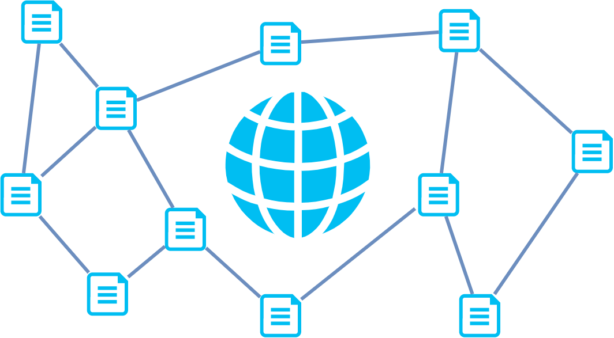
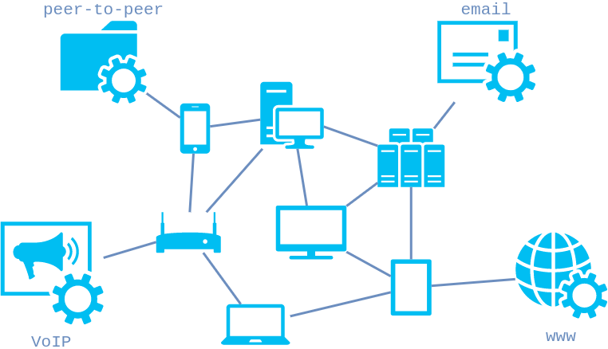

# Quelques métiers du web

Sylvain Schellenberger

Octobre 2021

## Développeur·se Web

<!-- .slide: data-background-image="assets/images/developer.png" -->

- Recueille le besoin du client
- "Pisse" du code
- Crée des bugs
- Recherche la solution sur Google

Autres noms: Développeur·se Fullstack, développeur·se back-end, développeur·se front-end

## Web Designer

<!-- .slide: data-background-image="assets/images/halston.jpg" -->

- Recueille le besoin du client
- Conçoit le parcours utilisateur
- Réalise les maquettes graphiques
- (Intègre sa propre maquette)

Autre noms: (info)graphiste

## Community Manager

<!-- .slide: data-background-image="assets/images/community.jpg" -->

- Recueille le besoin du client
- Conçoit la stratégie de communication
- Rédige les contenus web
- Prie Google pour un bon référencement

Autre noms: Brand manager, rédacteur·trice de contenus web, chargé·e de communication

## Administrateur système

<!-- .slide: data-background-image="assets/images/sys-admin.jpeg" -->

- Attend la fin du développement
- Déploie l'application sur des serveurs
- Surveille le trafic
- Blâme les failles de sécurité sur les développeurs

Autres noms: Administrateur réseau, architecte des systèmes d'information

---

# Connaissez-vous le web?

Sylvain Schellenberger

Octobre 2021

## Internet

Qu'est-ce que l'_Internet_?

1. Une entité extra-terrestre
2. Un monde invisible
3. Un résau mondial d'ordinateurs
4.  La réponse D

## 

InterNet = Interconnected Network

Notes: Internet désigne un réseau mondial par lequel les ordinateurs peuvent s'échanger des ressources.

## World Wide Web

Que signifie _World Wide Web_?

1. Le monde ne suffit pas
2. Toile d'araignée mondiale
3. La voie lactée
4. La réponse D

##

World Wide Web ~= Toile d'araignée mondiale

Notes: Désigne l'ensemble de document reliées par des liens hypertextes.

## Web vs. Internet

Le _Web_ et _Internet_ sont-ils la même chose?

1. Oui
2. Non
3. Ca dépend
4. La réponse D

##

Internet = Web + emails +  peer-to-peer + RSS + etc...

Notes: Internet englobe le Web ainsi que d'autres moyen de communication comme les e-mails ou le transfert de fichiers.

## Le navigateur

A quoi sert un navigateur web?

1. Consulter des ressources distantes
2. Diriger un bateau
3. Accéder à internet
4. Pirater des ordinateurs

##

Notes: Un navigateur web permet de consulter des ressources distantes (ou locales), souvent des pages web.

Il y a plusieurs manière d'utiliser internet, comme l'utilisation d'un logiciel  d'e-mail (Outlook, Thunderbird) ou d'un logiciel de torrent (bitTorrent).

Le navigateur interprète des fichiers texte. Le navigateur peut envoyer des requêtes à travers internet pour accéder à des fichiers distants.

## Fonctionnement d'internet

Le Web fonctionne sur le modèle:

1. Maître-esclave
2. Ami-Ami
3. Client-Serveur
4. Free-for-all

## 

1. Le client envoie une requête au serveur (via une adresse URL)
2. Le serveur interprète la requête et renvoie une réponse (ou pas)

## Le client et le serveur

Par conséquent, lorsque vous naviguez sur internet, qui est le client?

1. Google
2. Le navigateur
3. Microsoft
4. Stéphanie de Monaco

## 

Notes: Le navigateur agi comme client: c'est lui qui demande à accéder à la ressource que contient un serveur.

## URL

A quoi sert une adresse URL?

1. Trouver une ressource sur un réseau
2. Se déplacer avec un GPS
3. Envoyer un e-mail
4. Diriger un drone

##

URL = Uniform Resource Locator

Notes: Une adresse URL (Uniform Resource Locator) sert à trouver une ressource particulière (par exemple: une page web) sur un réseau.

## Les moteurs de recherche

Quel est le rôle d'un moteur de recherhce ?

1. Trouver de l'or
2. Faire avancer les voitures connectées
3. Mener des expériences scientifiques
4. Associer des ressources avec des mots clés

##

## Une question de protocole

Lorsqu'un navigateur (client) communique avec un serveur, ils échangent des données à travers le protocole:

1. HTTP(S)
2. LOL
3. (S)FTP
4. POP3

## 

HTTP = HyperText Transfer Protocol (Secure)

Notes: Le navigateur (client) et le serveur échangent des données à travers le protocole HTTP(S).

## Hyperliens

Qu'est-ce qu'un lien hypertexte (ou hyperlien)?

1. L'attraction mutuelle entre deux personnes
2. Un texte cliquable qui dirige vers un autre document
3. Un objet connecté à internet
4. Un câble connectant deux ordinateurs

</duv>

## 

Notes: Un lien hypertexte est une portion de texte interactive qui permet de relier plusieurs documents.

## A voir, à lire

- Le web expliqué en emojis: [https://www.youtube.com/watch?v=RHljpE7pZh8](https://www.youtube.com/watch?v=RHljpE7pZh8)
- Leçon et Quizzes: [https://openclassrooms.com/fr/courses/1946386-comprendre-le-web](https://openclassrooms.com/fr/courses/1946386-comprendre-le-web)